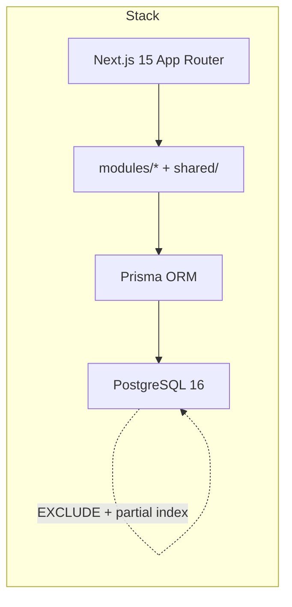

# AssetFlow

**Odoo Hackathon 2026 · Enterprise Asset & Resource Management**

Production-grade asset management platform for tracking assets, allocations, bookings, maintenance, and audits. Built with a **PostgreSQL-first**, **layered backend** and database-enforced business rules.

**Repository:** https://github.com/Shivayaagrawal/assetflow

---

## Hackathon Deliverable Summary

### What was asked

| Area | Requirement |
|------|-------------|
| **Core workflow** | Asset lifecycle → single active holder OR non-overlapping bookings → maintenance/audit gates status → notify + log every change |
| **Auth & RBAC** | Signup creates Employee only; Admin promotes roles; per-request DB role/status lookup |
| **Organization** | Departments, categories, employee directory (Screen 3) |
| **Assets** | Registration, 7-state lifecycle, search/QR, per-asset timeline (Screen 4) |
| **Allocation** | One active holder, transfer workflow, conflict UX (Screen 5) |
| **Booking** | EXCLUDE constraint, calendar view, overlap rejection (Screen 6) |
| **Maintenance** | Kanban, status cascade on approve/resolve (Screen 7) |
| **Audit** | Cycle workflow, close locks cycle, Missing → Lost (Screen 8) |
| **Dashboards** | Role-specific KPIs — Employee, Dept Head, Asset Manager (Screen 2) |
| **Reports** | Utilization analytics and trends (Screen 9) |
| **Notifications** | Transactional outbox, SWR polling (Screen 10) |
| **Activity log** | Append-only audit trail on every mutation |
| **Dynamic data** | No static JSON at runtime — all dropdowns and KPIs from PostgreSQL |

### What we delivered

| Tier | Item | Status |
|------|------|--------|
| **Tier 1** | Auth (signup, login, forgot/reset, logout, session purge on deactivation) | Complete |
| **Tier 1** | Organization Setup — departments, categories, role promotion | Complete |
| **Tier 1** | Asset registration, directory, detail + QR, asset timeline | Complete |
| **Tier 1** | Allocation + transfer with partial unique index conflict UX | Complete |
| **Tier 1** | Booking with PostgreSQL EXCLUDE + calendar UI | Complete |
| **Tier 1** | Maintenance Kanban + asset status cascade | Complete |
| **Tier 1** | Audit cycles — create, verify, close, Missing → Lost | Complete |
| **Tier 1** | Three role dashboards + operations dashboard | Complete |
| **Tier 1** | Notifications (transactional outbox + polling) | Complete |
| **Tier 1** | Activity log on all mutations | Complete |
| **Tier 2** | Reports & visual analytics (bar + SVG trend charts) | Complete |
| **Tier 2** | `RecentActivityFeed` on dashboards + `/activity` | Complete |
| **Tier 2** | CSV export (`/reports/export`) | Complete |
| **Tier 2** | Calendar booking view | Complete |
| **Tier 2** | Asset image upload | Complete |
| **Tier 3** | Depreciation, QR camera scan, PDF export, multi-company, ML | Explicitly cut |

---

## Live Demo (Local)

```bash
git clone https://github.com/Shivayaagrawal/assetflow.git
cd assetflow
cp .env.example .env

docker compose up -d postgres
npx prisma migrate dev
npm run seed
npm run dev
```

| URL | Purpose |
|-----|---------|
| http://localhost:3000 | Home / landing |
| http://localhost:3000/login | Sign in |
| http://localhost:3000/dashboard | Role-based dashboard |
| http://localhost:3000/reports | Charts (Dept Head / Asset Manager / Admin) |
| http://localhost:3000/activity | Audit trail — who did what |
| http://localhost:3000/api/health | Health check (`SELECT 1` via Prisma) |

**Password for all seed accounts:** `Password123!`

### Demo accounts (one login per role)

| Role | Email | Demo scenario |
|------|-------|---------------|
| **Admin** | `admin@assetflow.demo` | Org Setup, promote roles |
| **Asset Manager** | `maya@assetflow.demo` | Register assets, allocate, audits, reports |
| **Department Head** | `aditi@assetflow.demo` | Engineering approvals, dept reports |
| **Department Head** | `rohan@assetflow.demo` | Facilities department |
| **Employee** | `priya@assetflow.demo` | Allocated laptop AF-0114 |
| **Employee** | `procurement@assetflow.demo` | Room B2 booking (overlap demo) |
| **Employee** | `arjun@assetflow.demo` | Past return history |

Signup at `/signup` always creates **Employee**. Promote via **Admin → Org Setup → Employee Directory**.

### Suggested 5-minute judge walkthrough

1. `admin@assetflow.demo` → Org Setup → promote a user to Asset Manager
2. `maya@assetflow.demo` → Register asset → `/assets/new`
3. `maya@assetflow.demo` → Reports → visual analytics charts
4. `priya@assetflow.demo` → Book resource → `/booking`
5. `maya@assetflow.demo` → Activity → audit trail of who registered/booked/allocated

---

## Screens & Routes

Aligned with [docs/lld.md](docs/lld.md) and [docs/execution-plan.md](docs/execution-plan.md):

| Screen | Route | Roles |
|--------|-------|-------|
| Login / Signup | `/login`, `/signup` | Public |
| Dashboard | `/dashboard` | All (view varies by role) |
| Org Setup | `/org-setup` | Admin |
| Asset directory | `/assets` | All |
| Register asset | `/assets/new` | Asset Manager, Admin |
| Asset detail + QR + timeline | `/assets/[assetId]` | All |
| Allocation (manager) | `/allocation` | Asset Manager, Admin |
| My allocations | `/allocation/my` | Employee |
| Transfer approvals | `/allocation/approvals` | Dept Head, Asset Manager, Admin |
| Book resource | `/booking` | All |
| Dept booking | `/booking/department` | Dept Head, Asset Manager, Admin |
| Maintenance | `/maintenance` | Employee, Asset Manager, Admin |
| Maintenance queue | `/maintenance/queue` | Dept Head, Asset Manager, Admin |
| Audit | `/audit` | All (manage: Asset Manager, Admin) |
| Reports | `/reports` | Dept Head, Asset Manager, Admin |
| Notifications | `/notifications` | Employee, Asset Manager, Admin |
| Activity feed | `/activity` | All (scoped by role) |

Navigation is role-aware via `AppNav` + `src/shared/navigation/nav-config.ts`.

---

## Business Logic

Non-negotiable rules — full catalogue in [docs/business-invariants.md](docs/business-invariants.md).

### Asset lifecycle (7 states)

```
AVAILABLE → ALLOCATED → AVAILABLE
AVAILABLE → UNDER_MAINTENANCE → AVAILABLE
AVAILABLE → RESERVED → AVAILABLE
* → RETIRED / DISPOSED / LOST (terminal paths)
```

- Asset tag is **immutable**; serial number is **globally unique**
- Retired, disposed, and under-maintenance assets cannot be allocated
- State transitions enforced by `AssetStateMachine` + PostgreSQL constraints

### Allocation

- **One ACTIVE allocation per asset** (partial unique index)
- Concurrent allocate attempts return **409** with holder name
- Transfer closes old allocation before opening new one
- Allocation history is append-only

### Booking

- **No overlapping slots** for the same asset (PostgreSQL `EXCLUDE USING GIST`)
- Asset must be bookable and in `AVAILABLE` or `RESERVED` status
- Seeded overlap demo: Room B2 booked 09:00–10:00; 09:30–10:30 rejected, 10:00–11:00 accepted

### Maintenance

- One active maintenance request per asset
- Approve → asset `UNDER_MAINTENANCE`; resolve → `AVAILABLE`
- Technician cannot approve their own request

### Audit

- Closed cycles are immutable
- Each asset verified once per cycle
- On close: unverified Missing items → asset `LOST`

### Auth & RBAC

```
Session cookie → DB lookup (role + status) → Policy → Service → Repository
```

- Signup body **cannot** set `role` — locked in Better Auth config
- Only **Admin** promotes via Employee Directory
- Role/status changes take effect on the **next request** (fresh DB read)
- Deactivation deletes all sessions

### Activity log

Every mutation inside a transaction calls `logActivity(tx, …)`:

- Actor, action, entity type/id, timestamp
- Human-readable descriptions (e.g. "Maya Patel registered AF-0123 · Dell Laptop")
- **Employee** sees own actions; **Dept Head** sees department scope; **Manager/Admin** sees org-wide
- Per-asset timeline on asset detail page

### Notifications

`createNotification(tx, …)` runs in the **same transaction** as the triggering mutation (transactional outbox). Deduplicated by `(type, entityId, recipientId)`.

---

## Architecture Highlights

Two Tier 1 guarantees enforced **in PostgreSQL**:

```
Booking overlap     →  EXCLUDE USING GIST (tstzrange)
Active allocation   →  Partial unique index WHERE status = 'ACTIVE'
```



### Layered dependency rule

```
Presentation (app/) → Application (modules/) → Domain policies → Repository → PostgreSQL
```

- **Policies** own authorization — never inline `if (user.role === …)` in pages
- **Services** own one workflow each (`RegisterAssetService`, `AllocateAssetService`, …)
- **Repositories** own all Prisma access
- Cross-module orchestration happens inside services within `withTransaction()`

---

## Tech Stack

| Layer | Technology |
|-------|------------|
| Framework | Next.js 15, App Router, TypeScript strict |
| ORM | Prisma (`partialIndexes` preview) |
| Database | PostgreSQL 16 (Docker) |
| Auth | Better Auth (session-based) |
| Validation | Zod |
| Frontend data | SWR polling (notifications) |
| Testing | Vitest (89 tests) |
| Deploy | Docker Compose |
| Dates | `en-IN` locale, `Asia/Kolkata` timezone |

---

## Requirements

```bash
node -v          # Node.js 22 LTS recommended
npm -v           # npm 10+
docker --version
docker compose version
```

| Tool | Version |
|------|---------|
| Node.js | 22 LTS (20+ supported) |
| npm | 10+ |
| Docker Desktop | 4.x+ |
| Docker Compose | v2+ |

PostgreSQL runs in Docker on host port **5433** (see `.env.example`).

---

## Repository Structure

```
assetflow/
├── docs/
│   ├── hld.md                 # High-level design — system context, modules
│   ├── lld.md                 # Low-level design — schema, sequences, contracts
│   ├── execution-plan.md      # Hackathon tier plan and validation gates
│   ├── architecture.md        # Docker, CI, auth layers
│   ├── business-invariants.md # Domain rules
│   └── errors.md              # Canonical error catalogue
├── backend/
│   ├── database/constraints.md
│   └── engineering/           # State transitions, permissions, edge cases
├── prisma/schema.prisma       # 16 core models + Better Auth tables
├── src/
│   ├── app/                   # Routing only — pages and API routes
│   ├── modules/               # identity, organization, asset, allocation, booking, …
│   ├── shared/                # auth, errors, transactions, format, navigation
│   ├── components/            # AppNav, AccessDenied, BookingCalendar, …
│   └── lib/                   # db, auth, env, logger
├── tests/                     # unit + integration + workflow tests
└── docker-compose.yml
```

---

## Features by Role

| Role | Capabilities |
|------|-------------|
| **Employee** | Dashboard, my allocations, book resources, raise maintenance, activity (own) |
| **Department Head** | Dept dashboard, approvals, dept booking, reports, activity (dept scope) |
| **Asset Manager** | Register/allocate assets, maintenance queue, audits, reports, org-wide activity |
| **Admin** | Organization Setup — departments, categories, employee directory, role promotion |

---

## Development Workflow

```bash
npm run lint && npm run typecheck && npm run test && npm run build
```

Commit format:

```
feat(scope): short summary

Why: business or engineering reason
Does: concrete behavior change
```

---

## Troubleshooting

### Database connection (`P1010` / auth failed)

1. `docker compose up -d postgres`
2. Confirm `.env` uses port **5433**
3. If Homebrew PostgreSQL conflicts: `brew services stop postgresql@17` or keep Docker on 5433

### Unstyled UI (broken layout, bunched nav links)

CSS 404 usually means a stale `.next` cache or multiple dev servers:

```bash
pkill -f "next dev"
rm -rf .next
npm run dev
```

Hard-refresh the browser (`Cmd+Shift+R`). Use **http://localhost:3000** (not an old port).

### Seed data missing

```bash
npm run seed
```

---

## Documentation

| Document | Purpose |
|----------|---------|
| [docs/hld.md](docs/hld.md) | System context, modules, design decisions |
| [docs/lld.md](docs/lld.md) | Schema, API contracts, sequence diagrams |
| [docs/user-perspective-erd.md](docs/user-perspective-erd.md) | Role-based ERD — Employee, Dept Head, Manager, Admin |
| [docs/execution-plan.md](docs/execution-plan.md) | Tier 1/2/3 plan and validation gates |
| [docs/architecture.md](docs/architecture.md) | Docker, CI, auth layers, notifications |
| [docs/business-invariants.md](docs/business-invariants.md) | Domain rules |
| [docs/errors.md](docs/errors.md) | Canonical API error catalogue |
| [backend/database/constraints.md](backend/database/constraints.md) | PostgreSQL guarantees |
| [backend/engineering/permission-matrix.md](backend/engineering/permission-matrix.md) | RBAC matrix |

---

## License

See [LICENSE](LICENSE).
