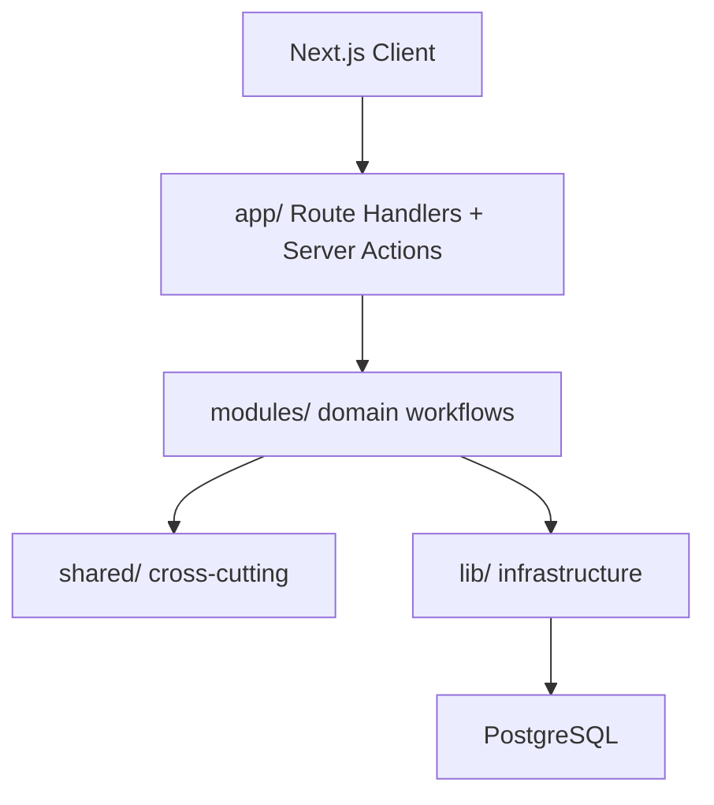

# AssetFlow — Project Overview

Enterprise asset and resource management for the Odoo Hackathon 2026.

## Architecture



### Request Flow (mutations)

```
Server Action → Validator → Policy → Application Service → Repository → PostgreSQL
```

## Module Map

| Module | Owns |
|--------|------|
| identity | Users, sessions, authentication |
| organization | Departments, categories, employees |
| asset | Registration, lifecycle, metadata |
| allocation | Allocation, transfer, return |
| booking | Shared resources, time slots |
| maintenance | Requests, approval, resolution |
| audit | Audit cycles, verification |
| notification | User notifications |
| activity | Timeline, audit trail |
| reporting | Read-only dashboards |

## Architecture Status

**Frozen.** Do not redesign. Remaining work is faithful implementation of documented contracts, P0 workflow tests, live PostgreSQL reads on every screen, and end-to-end smoke scenarios.

---

## Documentation Index

| Document | Contents |
|----------|----------|
| [docs/hld.md](../docs/hld.md) | High-level system design |
| [docs/lld.md](../docs/lld.md) | Schema, sequences, API contracts |
| [docs/architecture.md](../docs/architecture.md) | Docker, CI, auth, notifications |
| [docs/errors.md](../docs/errors.md) | Canonical error catalogue |
| [database/constraints.md](./database/constraints.md) | PostgreSQL guarantees |
| [engineering/auth-lifecycle.md](./engineering/auth-lifecycle.md) | Login, logout, sessions, deactivation |
| [engineering/security.md](./engineering/security.md) | Password policy, rate limiting, file upload |
| [engineering/state-transition-matrix.md](./engineering/state-transition-matrix.md) | Asset status transitions |
| [engineering/edge-cases.md](./engineering/edge-cases.md) | Prioritized edge cases + pre-demo checklist |
| [engineering/permission-matrix.md](./engineering/permission-matrix.md) | RBAC matrix |
