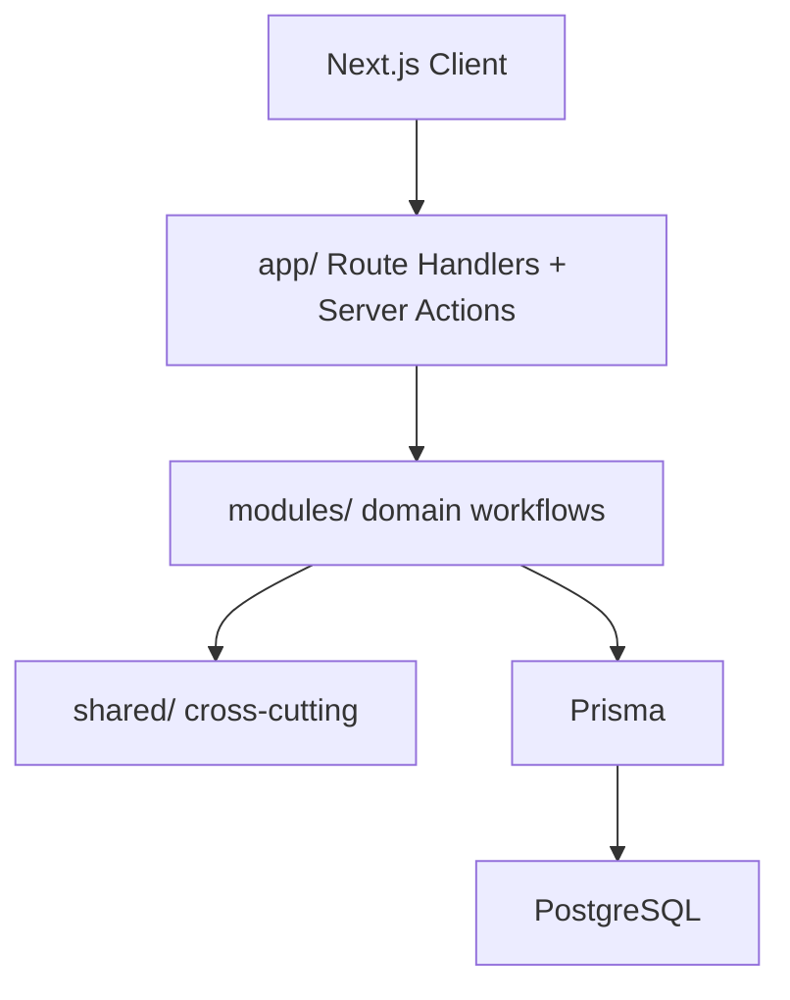

# AssetFlow — Project Overview

Enterprise asset and resource management for the Odoo Hackathon 2026.

## Architecture

## Module Map

| Module | Owns |
|--------|------|
| identity | Users, sessions, authentication |
| organization | Departments, categories, employees |
| asset | Registration, lifecycle, metadata |
| allocation | Allocation, transfer, return |
| booking | Shared resources, time slots |
| maintenance | Requests, approval, resolution |
| audit | Audit cycles, verification |
| notification | User notifications |
| activity | Timeline, audit trail |
| reporting | Read-only dashboards |

## Documentation Index

- [architecture/01-hld.md](./architecture/01-hld.md) — high-level design
- [database/constraints.md](./database/constraints.md) — PostgreSQL guarantees
- [engineering/edge-cases.md](./engineering/edge-cases.md) — prioritized edge cases
- [engineering/error-catalog.md](./engineering/error-catalog.md) — error codes
