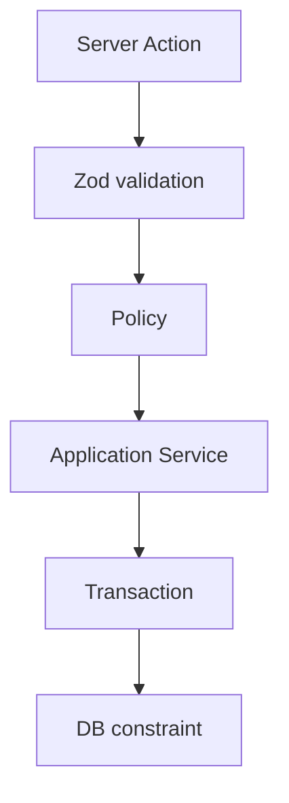

# Database Constraints

Every business rule enforced at the PostgreSQL layer. Source of truth: `prisma/migrations/`.

## Enforcement Stack



## Constraint Inventory

| Rule | Type | Migration |
|------|------|-----------|
| Serial unique | UNIQUE | init |
| Asset tag unique | UNIQUE | init |
| One active allocation | Partial UNIQUE INDEX | business_constraints |
| No overlapping bookings | EXCLUDE (gist) | business_constraints |
| End > start | CHECK | business_constraints |
| Cost >= 0 | CHECK | business_constraints |
| Return after allocate | CHECK | business_constraints |
| One active maintenance | Partial UNIQUE INDEX | business_constraints |
| Notification dedup | UNIQUE INDEX | business_constraints |
| Asset tag sequence | SEQUENCE | asset_tag_sequence |
| btree_gist extension | EXTENSION | business_constraints |

## Verify Locally

```bash
npx prisma migrate deploy
psql $DATABASE_URL -c '\d+ "Booking"'
psql $DATABASE_URL -c '\d+ "Allocation"'
```

Expected: `no_overlapping_bookings` on Booking, `one_active_allocation_per_asset` on Allocation.
