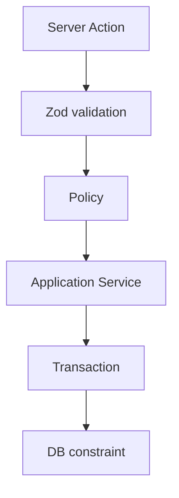

# Database Constraints

Every business rule enforced at the PostgreSQL layer. Source of truth: `prisma/migrations/`.

## Enforcement Stack



## Constraint Inventory

| Rule | Type | Migration |
|------|------|-----------|
| Serial unique | UNIQUE | init |
| Asset tag unique | UNIQUE | init |
| One active allocation | Partial UNIQUE INDEX | business_constraints |
| No overlapping bookings | EXCLUDE (gist) | business_constraints |
| End > start | CHECK | business_constraints |
| Cost >= 0 | CHECK | business_constraints |
| Return after allocate | CHECK | business_constraints |
| One active maintenance | Partial UNIQUE INDEX | business_constraints |
| Notification dedup | UNIQUE INDEX | business_constraints |
| Asset tag sequence | SEQUENCE | asset_tag_sequence |
| Asset tag sequence init | `setval` after seed | `prisma/seed.ts` |
| btree_gist extension | EXTENSION | business_constraints |

## Verify Locally

```bash
npx prisma migrate deploy
psql $DATABASE_URL -c '\d+ "Booking"'
psql $DATABASE_URL -c '\d+ "Allocation"'
```

Expected: `no_overlapping_bookings` on Booking, `one_active_allocation_per_asset` on Allocation.

## Asset Tag Sequence After Seed

Seeded assets use explicit tags (e.g. `AF-0114`). Without resetting the sequence, `nextval('asset_tag_seq')` may produce colliding tags.

After seed:

```sql
SELECT setval('asset_tag_seq', GREATEST(
  COALESCE((
    SELECT MAX(CAST(SUBSTRING("assetTag" FROM 4) AS INTEGER))
    FROM "Asset"
    WHERE "assetTag" ~ '^AF-[0-9]+$'
  ), 0),
  200
));
```

`prisma/seed.ts` runs this automatically. Floor of `200` keeps generated tags above all demo seed values.
