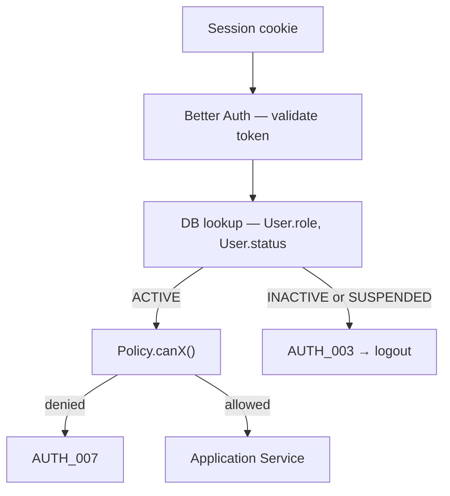
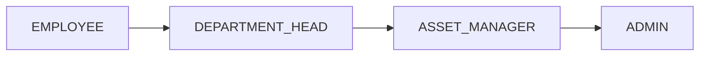

# Auth Lifecycle

Authentication and authorization are **complete lifecycle management**, not login alone. Every protected request derives identity and permissions from the **current database state**, not stale session payload.

**Related:** [permission-matrix.md](./permission-matrix.md) · [business-invariants.md](../../docs/business-invariants.md) · [errors.md](../../docs/errors.md)

---

## Feature Priority

| Feature | Priority | Status |
|---------|----------|--------|
| Login | P0 | Partial (Better Auth) |
| Logout | P0 | Open |
| Session expiration | P0 | Partial (Better Auth) |
| Password reset | P0 | Open |
| Change password | P1 | Open |
| Role-based access (RBAC) | P0 | Partial (policies) |
| Session revocation | P1 | Open |
| User deactivation | P0 | Open |
| Role promotion/demotion | P0 | Open |
| Force logout after deactivation | P1 | Open |

---

## Request Flow



**Invariant:** If a user's role or active status changes, all future authorization decisions use the latest database state. Existing sessions do not retain revoked permissions.

Effects:

- Role changes take effect immediately.
- Deactivated users lose access immediately.
- Demoted users lose elevated permissions immediately.
- Promoted users gain access immediately.

Implementation: `requireSessionUser()` in `shared/auth/session.ts` validates the Better Auth session, then **re-fetches** `User` from PostgreSQL before policy checks.

---

## Login

```
Email + Password → Better Auth → Session cookie → Dashboard (role-based)
```

Signup always creates `EMPLOYEE`. No API accepts `role` in the signup body.

Password policy: minimum 8 characters, at least one uppercase, one lowercase, one number. See [security.md](./security.md).

Login rate limiting (recommended): 5 failed attempts per email → 15-minute lock → `GEN_004`. See [security.md](./security.md).

---

## Logout

```
POST /logout → Delete session row → Clear cookie → Redirect /login
```

---

## Session Expiration

Better Auth enforces `Session.expiresAt`. Expired sessions return `AUTH_002` (401) and redirect to login.

---

## Password Reset

| Rule | Enforcement |
|------|-------------|
| Token expires in 15 minutes | `Verification.expiresAt` |
| One-time use | Mark consumed after reset |
| Stored hashed | Never store plaintext token |
| New token invalidates previous | Delete prior tokens for user |
| Reset invalidates all sessions | Delete all `Session` rows for user |

Error codes: `AUTH_004` (invalid/expired), `AUTH_005` (already used).

---

## Change Password (P1)

Authenticated user provides current + new password. On success: invalidate all other sessions (optional: keep current session).

---

## Role Management



| Rule | Enforcement |
|------|-------------|
| Signup creates `EMPLOYEE` only | `User.role` default + `input: false` in Better Auth |
| Role change only via Admin | `promoteEmployee` action — `ADMIN` only |
| Client cannot send `role` | Ignored on signup; rejected on other mutations |
| Role change audited | `ActivityLog`: actor, target, old role, new role, timestamp |

---

## User Status

```prisma
enum UserStatus { ACTIVE INACTIVE SUSPENDED }
```

| Status | Login | Book | Allocate | Receive assets | Notes |
|--------|-------|------|----------|----------------|-------|
| ACTIVE | Yes | Yes | Yes | Yes | Normal operation |
| INACTIVE | No | No | No | No | Left company; history preserved |
| SUSPENDED | No | No | No | No | Under review; audit history preserved |

Deactivation sets `status = INACTIVE`. Effects:

- Cannot log in (`AUTH_003` at login and on every request)
- Cannot receive new allocations
- Cannot create bookings
- Existing allocation/booking history remains

---

## Session Revocation

On deactivation or role demotion that removes access:

```
Admin deactivates user → DELETE FROM Session WHERE userId = ? → User logged out immediately
```

Even without explicit session deletion, the per-request DB status check returns `AUTH_003` on the next request.

---

## Permission Matrix

| Action | Employee | Dept Head | Asset Manager | Admin |
|--------|----------|-----------|---------------|-------|
| Login | Yes | Yes | Yes | Yes |
| Logout | Yes | Yes | Yes | Yes |
| View own assets | Yes | Yes | Yes | Yes |
| View department | No | Yes | Yes | Yes |
| Allocate asset | No | No | Yes | Yes |
| Transfer asset | No | No | Yes | Yes |
| Maintenance approval | No | No | Yes | Yes |
| Manage departments | No | No | No | Yes |
| Promote roles | No | No | No | Yes |
| Deactivate employee | No | No | No | Yes |
| View audit logs | Own | Dept | All | All |

Department Head scope enforced via `assertDepartmentAccess()` — see [permission-matrix.md](./permission-matrix.md).

---

## Identity Module Actions

| Action | Auth | Rule |
|--------|------|------|
| `signUp` | Public | Always `EMPLOYEE`; ignore body `role` |
| `signIn` | Public | Block `INACTIVE` / `SUSPENDED` → `AUTH_003` |
| `signOut` | Authenticated | Delete current session; clear cookie |
| `forgotPassword` | Public | 15-min hashed one-time token |
| `resetPassword` | Public | Validate token; invalidate all sessions |
| `changePassword` | Authenticated | P1; invalidate other sessions |
| `promoteEmployee` | `ADMIN` | Only path to change `User.role`; writes activity log |
| `deactivateEmployee` | `ADMIN` | Set `INACTIVE`; delete all sessions; block if last admin |

---

## Error Codes

| Code | When | HTTP |
|------|------|------|
| `AUTH_001` | Invalid credentials | 401 |
| `AUTH_002` | Session expired or missing | 401 |
| `AUTH_003` | Account inactive or suspended | 403 |
| `AUTH_004` | Reset token invalid/expired | 400 |
| `AUTH_005` | Reset token already used | 400 |
| `AUTH_006` | Email already registered | 409 |
| `AUTH_007` | Insufficient permissions | 403 |
