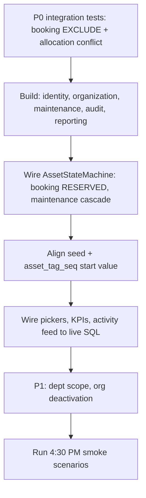

# Edge Cases — Implementation Backlog

Prioritized inventory after architecture freeze (`modules/` + `shared/`), `AssetStateMachine`, asset tag sequence, and dynamic data rules.

**Status legend**

| Status | Meaning |
|--------|---------|
| `Done` | Code + test exist |
| `Partial` | Protection exists; service or integration test missing |
| `Open` | Not implemented |

**Test types**

| Type | Location |
|------|----------|
| Unit / policy | `tests/workflows/*.test.ts` |
| Integration | `tests/integration/*.test.ts` (to add) |

Canonical error codes: [docs/errors.md](../../docs/errors.md)

---

## Pre-Demo Verification Checklist

Must pass before 4:30 PM smoke scenarios. Status tracks implementation — not documentation.

### Authentication

- [ ] Duplicate signup → `AUTH_006`
- [ ] Signup with `role: ADMIN` in body ignored
- [ ] Deactivated user with active session → `AUTH_003` on next request
- [ ] Password reset token reuse → `AUTH_005`
- [ ] Password reset invalidates all sessions
- [ ] Last admin cannot be deactivated → `ORG_005`

### Allocation

- [ ] Concurrent allocation → `ASSET_004`
- [ ] Double-click allocation → `ASSET_004`
- [ ] Transfer to inactive employee → `ALLOC_005`
- [ ] Return twice → `ALLOC_003`
- [ ] Transfer to same employee → `ALLOC_004`

### Booking

- [ ] Overlap (09:30 vs seeded 09:00–10:00) → `BOOKING_002`
- [ ] Adjacent slot (10:00–11:00) accepted
- [ ] Book retired asset → `BOOKING_004`
- [ ] Book maintenance asset → `BOOKING_004`
- [ ] Book in the past → `GEN_001`

### Maintenance

- [ ] Approve twice → `MAINT_005`
- [ ] Duplicate active request → `MAINT_002`
- [ ] Resolve rejected request → `MAINT_004`
- [ ] Approve own request → `MAINT_003`

### Audit

- [ ] Close twice → `AUDIT_003`
- [ ] Verify same asset twice → `AUDIT_002`
- [ ] Overlapping audit cycles → `AUDIT_005`

### Organization

- [ ] Circular department hierarchy → `ORG_002`
- [ ] Deactivate dept with active employees → `ORG_003`
- [ ] Deactivate category with active assets → `ORG_004`

### UI / Dynamic Data

- [ ] Department rename reflected in `DepartmentPicker` (no hardcoded lists)
- [ ] Dashboard KPIs from live SQL (not cached)
- [ ] Activity feed from `ActivityLog` table
- [ ] Notifications from `Notification` table
- [ ] Search uses PostgreSQL ILIKE on indexed fields

---

## Already Covered (protection exists)

| Area | Protection | Service | Status | Test |
|------|------------|---------|--------|------|
| Double allocation | Partial unique index + pre-check | `AllocateAssetService` | Partial | — |
| Booking overlap | EXCLUDE constraint | `CreateBookingService` | Partial | — |
| Duplicate serial | UNIQUE + pre-check | `RegisterAssetService` | Partial | — |
| Asset tag race | `asset_tag_seq` + `nextval()` in tx | `AssetRepository.nextAssetTag()` | Partial | `asset-tag-format.test.ts` |
| Invalid status transition | `AssetStateMachine` | allocate / return only | Partial | `asset-state-machine.test.ts` |
| Return twice | Status check | `ReturnAssetService` | Partial | — |
| Overdue notification dup | `notification_dedup_key` | `runOverdueScan()` | Partial | — |
| Duplicate maintenance | Partial unique index | — | Open (DB only) | — |
| Terminal states | Policy + state machine | `AssetPolicy` | Partial | `asset-policy.test.ts` |

---

## P0 — Must Work (demo-critical)

### Auth and identity

| Edge Case | Code | Protection | Module | Status | Test |
|-----------|------|------------|--------|--------|------|
| Duplicate signup | `AUTH_006` | UNIQUE email | `identity` | Open | — |
| Signup with `role: ADMIN` in body | — | Server ignores role | `identity` | Open | — |
| Inactive employee login | `AUTH_003` | `User.status` check | `identity` | Open | — |
| Suspended employee login | `AUTH_003` | `User.status` check | `identity` | Open | — |
| Deactivated user with live session | `AUTH_003` | Per-request DB status lookup | `shared/auth` | Partial | — |
| Role demoted while logged in | `AUTH_007` | Per-request DB role lookup | `shared/auth` | Partial | — |
| Role promoted while logged in | — | Per-request DB role lookup | `shared/auth` | Partial | — |
| Forgot-password token reuse | `AUTH_005` | One-time hashed token | `identity` | Open | — |
| Sessions invalidated on password reset | — | Delete all sessions | `identity` | Open | — |
| Deactivate deletes all sessions | — | `DELETE Session WHERE userId` | `identity` | Open | — |
| Role change writes activity log | — | `logActivity` on promote | `identity` | Open | — |
| Deactivate last admin blocked | `ORG_005` | Service check | `identity` | Open | — |

### Asset lifecycle

| Edge Case | Code | Protection | Module | Status | Test |
|-----------|------|------------|--------|--------|------|
| Allocate already-allocated asset | `ASSET_004` | Partial unique index | `allocation` | Partial | — |
| Surface holder name + transfer offer on conflict | `ASSET_004` | Service reads active allocation | `allocation` | Open | — |
| Allocate retired/disposed asset | `ASSET_006` | Policy + state machine | `asset` | Partial | `asset-policy.test.ts` |
| Allocate under-maintenance asset | `ASSET_005` | Policy | `asset` | Partial | `asset-policy.test.ts` |
| Invalid transition (e.g. RETIRED → AVAILABLE) | `ASSET_003` | `AssetStateMachine` | `asset` | Partial | `asset-state-machine.test.ts` |
| Duplicate serial on register | `ASSET_002` | UNIQUE + pre-check | `asset` | Partial | — |
| Modify asset tag after creation | `ASSET_007` | Immutable field | `asset` | Open | — |

### Booking

| Edge Case | Code | Protection | Module | Status | Test |
|-----------|------|------------|--------|--------|------|
| Overlap 09:30 vs seeded 09:00–10:00 | `BOOKING_002` | EXCLUDE (`23P01`) | `booking` | Partial | — |
| Adjacent slot 10:00–11:00 accepted | — | EXCLUDE boundary `[)` | `booking` | Partial | — |
| Book non-bookable asset | `BOOKING_004` | Policy | `booking` | Partial | — |
| Book allocated / maintenance asset | `BOOKING_004` | Policy | `booking` | Partial | — |
| Book in the past | `GEN_001` | Service check | `booking` | Partial | — |
| Asset status → RESERVED on book | `ASSET_003` | State machine + service | `booking` | Open | — |
| Edit cancelled booking | `BOOKING_005` | Status check | `booking` | Open | — |

### Allocation and transfer

| Edge Case | Code | Protection | Module | Status | Test |
|-----------|------|------------|--------|--------|------|
| Return twice | `ALLOC_003` | Status check | `allocation` | Partial | — |
| Transfer without closing old allocation | — | Single transaction | `allocation` | Open | — |
| Transfer to same employee | `ALLOC_004` | Validator | `allocation` | Open | — |
| Transfer to inactive employee | `ALLOC_005` | Policy | `allocation` | Open | — |
| Concurrent allocate (two managers) | `ASSET_004` | Partial unique index | `allocation` | Partial | — |

### Maintenance

| Edge Case | Code | Protection | Module | Status | Test |
|-----------|------|------------|--------|--------|------|
| Approve twice | `MAINT_005` | `WHERE status = 'PENDING'` | `maintenance` | Open | — |
| Two active maintenance requests | `MAINT_002` | Partial unique index | `maintenance` | Open | — |
| Approve own request | `MAINT_003` | Policy | `maintenance` | Open | — |
| Approve → asset UNDER_MAINTENANCE | `ASSET_003` | Service + state machine | `maintenance` | Open | — |
| Resolve rejected request | `MAINT_004` | Status check | `maintenance` | Open | — |

### Audit

| Edge Case | Code | Protection | Module | Status | Test |
|-----------|------|------------|--------|--------|------|
| Close audit twice | `AUDIT_003` | Status check | `audit` | Open | — |
| Verify same asset twice in cycle | `AUDIT_002` | UNIQUE per cycle | `audit` | Open | — |
| Modify closed audit | `AUDIT_004` | Immutable | `audit` | Open | — |
| Missing → Lost only on close | `ASSET_003` | Service transaction | `audit` | Open | — |
| Overlapping audit cycles | `AUDIT_005` | Service check | `audit` | Open | — |

---

## P1 — Business Rules

| Edge Case | Code | Protection | Module | Status | Test |
|-----------|------|------------|--------|--------|------|
| Dept Head approves other department | `AUTH_007` | `DepartmentPolicy` | `organization` | Partial | `allocation-policy.test.ts` |
| Dept Head scoped booking/view | `AUTH_007` | Scoped queries | `organization` | Open | — |
| Remove last admin | `ORG_005` | Service check | `organization` | Open | — |
| Deactivate dept with active employees | `ORG_003` | Service check | `organization` | Open | — |
| Deactivate category with active assets | `ORG_004` | Service check | `organization` | Open | — |
| Department hierarchy cycle | `ORG_002` | Service validation | `organization` | Open | — |
| Lost asset cannot be booked | `BOOKING_004` | Policy | `booking` | Open | — |
| Role promotion only via Admin directory | `AUTH_007` | Identity service | `identity` | Open | — |
| Employee directory live from DB | — | Repository query | `organization` | Open | — |

---

## P2 — Validation

| Edge Case | Code | Protection | Module | Status | Test |
|-----------|------|------------|--------|--------|------|
| Invalid email | `GEN_001` | Zod | `shared` | Open | — |
| Future acquisition date | `GEN_001` | Zod | `asset` | Open | — |
| Negative cost | `GEN_001` / CHECK | CHECK constraint | `asset` | Partial | — |
| Booking start >= end | `BOOKING_003` | Zod + CHECK | `booking` | Partial | `create-booking-schema.test.ts` |
| Return date < allocation date | `ALLOC_006` | CHECK constraint | `allocation` | Partial | — |
| Client sends `userId` / `role` / `departmentId` | — | Session-derived identity | `shared` | Partial | — |

---

## P3 — UX and Dynamic Data

Per [docs/hld.md §4](../../docs/hld.md) and [execution-plan Dynamic Data Checklist](../../docs/execution-plan.md).

| Edge Case | Expected | Component / Module | Status |
|-----------|----------|----------------------|--------|
| Hardcoded department dropdown | Live from DB | `DepartmentPicker` | Open (stub) |
| Dashboard static KPIs | Live `COUNT()` / `GROUP BY` | `reporting` | Open |
| Reports from cached JSON | Live SQL | `reporting` | Open |
| Refresh after 409 conflict | UI shows current DB state | Frontend | Open |
| Double-click allocate/return | Second request → 409 | Frontend + service | Partial |
| Department rename mid-session | Picker reflects live data | `DepartmentPicker` | Open |
| Seed file read at runtime | Never | App | Done (documented) |
| Activity feed after mutation | Queries `ActivityLog` | `RecentActivityFeed` | Open (stub) |
| Stale notifications | SWR polling | `notification` | Open |
| Search hardcoded list | PostgreSQL ILIKE | `asset` | Open |
| Pagination on lists | SQL LIMIT/OFFSET | `shared` (future) | Open |

---

## Architecture-Specific Edge Cases

### Asset tag sequence

| Edge Case | Expected | Status | Test |
|-----------|----------|--------|------|
| Two concurrent registrations | Distinct tags | Partial | — |
| Sequence gap after rollback | Acceptable | Done | — |
| Seed tags vs sequence collision | Sequence starts above max seed tag | Open | Align `asset_tag_seq` in seed/migration |

**Action:** After seeding, run `SELECT setval('asset_tag_seq', (SELECT MAX(...) FROM tags))` or start sequence at 200+.

### AssetStateMachine

| Transition | Expected | Wired | Test |
|------------|----------|-------|------|
| AVAILABLE → RESERVED (booking) | Allowed | Open | `asset-state-machine.test.ts` |
| ALLOCATED → RESERVED | Blocked | Done | `asset-state-machine.test.ts` |
| UNDER_MAINTENANCE → ALLOCATED | Blocked | Done | `asset-state-machine.test.ts` |
| RESERVED → AVAILABLE (cancel) | Allowed | Open | — |
| Same-status update | Allowed (no-op) | Done | `asset-state-machine.test.ts` |

### Transactional side effects

| Edge Case | Expected | Status |
|-----------|----------|--------|
| DB rollback rolls back notification | Same transaction | Partial |
| Every mutation logs activity | `logActivity(tx)` | Partial |
| `oldValue` / `newValue` on status change | Both required on every status transition | Partial (return only) |

---

## Test Matrix (by workflow)

Build one workflow file per domain under `tests/integration/`:

```
tests/integration/
├── register-asset.workflow.test.ts      # P0 asset
├── allocate-asset.workflow.test.ts      # P0 allocation — demo critical
├── create-booking.workflow.test.ts      # P0 booking — demo critical
├── return-asset.workflow.test.ts        # P0 allocation
├── approve-maintenance.workflow.test.ts # P0 maintenance (when built)
└── close-audit.workflow.test.ts         # P0 audit (when built)
```

### Register Asset

| Scenario | Code | Test file | Status |
|----------|------|-----------|--------|
| Happy path | — | `register-asset.workflow.test.ts` | Open |
| Duplicate serial | `ASSET_002` | same | Open |
| Negative cost | `GEN_001` / CHECK | same | Open |
| Concurrent tag generation | — | same | Open |

### Allocate Asset

| Scenario | Code | Test file | Status |
|----------|------|-----------|--------|
| Happy path | — | `allocate-asset.workflow.test.ts` | Open |
| Already allocated + holder name | `ASSET_004` | same | Open |
| Retired asset | `ASSET_006` | same | Open |
| Under maintenance | `ASSET_005` | same | Open |
| Invalid transition | `ASSET_003` | same | Open |
| Concurrent allocation | `ASSET_004` | same | Open |

### Book Resource

| Scenario | Code | Test file | Status |
|----------|------|-----------|--------|
| Happy path | — | `create-booking.workflow.test.ts` | Open |
| Overlap 09:30 vs 09:00 (demo) | `BOOKING_002` | same | Open |
| Adjacent 10:00–11:00 | — | same | Open |
| Non-bookable asset | `BOOKING_004` | same | Open |
| Past start time | `GEN_001` | same | Open |

### Return Asset

| Scenario | Code | Test file | Status |
|----------|------|-----------|--------|
| Happy path | — | `return-asset.workflow.test.ts` | Open |
| Already returned | `ALLOC_003` | same | Open |
| Double click | `ALLOC_003` | same | Open |

---

## Demo Smoke Scenarios (must pass)

From [docs/execution-plan.md §4:30 PM](../../docs/execution-plan.md):

| # | Scenario | Edge cases exercised |
|---|----------|---------------------|
| 1 | AF-0114 allocate to Priya → re-allocate blocked → transfer offered | Double allocation, holder name |
| 2 | Room B2: 09:30–10:30 rejected, 10:00–11:00 accepted | EXCLUDE overlap, adjacent slot |
| 3 | Department rename live-updates picker | Dynamic data |
| 4 | Maintenance approve → asset Under Maintenance | State cascade |
| 5 | Every notification type fired once | Transactional notifications |
| 6 | `docker compose up` clean clone | Infrastructure |

---

## Implementation Priority



1. Integration tests for booking overlap and concurrent allocation
2. Build missing modules (identity, organization, maintenance, audit, reporting)
3. Wire `AssetStateMachine` into booking and maintenance cascades
4. Align `asset_tag_seq` with seed data
5. Wire dynamic UI per Dynamic Data Checklist
6. Run execution-plan smoke scenarios

---

## Concurrency Reference

| Workflow | Race | Protection | Response |
|----------|------|------------|----------|
| Allocate | Two managers allocate simultaneously | Partial unique index | `409 ASSET_004` |
| Booking | Overlapping time slots | EXCLUDE constraint | `409 BOOKING_002` |
| Transfer | Approve twice | `WHERE status = 'REQUESTED'` | 409 |
| Return | Double click | Status validation | `409 ALLOC_003` |
| Close audit | Close twice | Cycle status check | `409 AUDIT_003` |
| Maintenance | Duplicate active request | Partial unique index | `409 MAINT_002` |
| Overdue notification | Cron runs twice | `notification_dedup_key` | Skip (idempotent) |
| Asset tag | Concurrent register | `asset_tag_seq` | Distinct tags |

See also [lld.md §10–11](../../docs/lld.md) and [state-transition-matrix.md](./state-transition-matrix.md).
