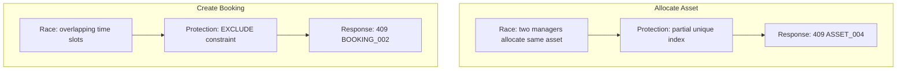

# Edge Cases by Priority

Organized for implementation order. Status: `Open` until code + test exist.

## P0 — Must Work

| Edge Case | Error Code | Protection | Status |
|-----------|------------|------------|--------|
| Duplicate signup | AUTH_006 | UNIQUE email | Open |
| Duplicate serial | ASSET_002 | UNIQUE serial | Partial |
| Double allocation | ASSET_004 | Partial unique index | Partial |
| Booking overlap | BOOKING_002 | EXCLUDE constraint | Partial |
| Return twice | ALLOC_003 | Service status check | Partial |
| Approve twice | MAINT_005 | Service status check | Open |
| Audit close twice | AUDIT_003 | Service status check | Open |

## P1 — Business Rules

| Edge Case | Error Code | Protection | Status |
|-----------|------------|------------|--------|
| Inactive employee login | AUTH_003 | User.status | Open |
| Retired asset allocation | ASSET_006 | Policy + service | Partial |
| Lost asset booking | BOOKING_004 | Policy | Partial |
| Booking during maintenance | BOOKING_004 | Policy | Partial |
| Department scope bypass | AUTH_007 | Policy | Partial |
| Remove last admin | ORG_005 | Service | Open |

## P2 — Validation

| Edge Case | Error Code | Protection | Status |
|-----------|------------|------------|--------|
| Invalid email | GEN_001 | Zod | Open |
| Future acquisition date | GEN_001 | Zod | Open |
| Negative cost | GEN_001 | CHECK constraint | Partial |
| Start >= End booking | BOOKING_003 | Zod + CHECK | Partial |

## P3 — UX

| Edge Case | Protection | Status |
|-----------|------------|--------|
| Multiple allocate clicks | Partial unique + 409 | Partial |
| Refresh after conflict | Idempotent read | Open |
| Pagination on lists | SQL LIMIT/OFFSET | Open |

## Concurrency Reference

