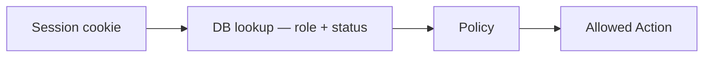

# Permission Matrix

Authorization always uses **current** `User.role` and `User.status` from PostgreSQL — never stale session payload. See [auth-lifecycle.md](./auth-lifecycle.md).

## Identity

| Action | Employee | Dept Head | Asset Manager | Admin |
|--------|----------|-----------|---------------|-------|
| Login | Yes | Yes | Yes | Yes |
| Logout | Yes | Yes | Yes | Yes |
| Promote roles | No | No | No | Yes |
| Deactivate employee | No | No | No | Yes |

## Domain

| Action | Employee | Dept Head | Asset Manager | Admin |
|--------|----------|-----------|---------------|-------|
| View own assets | Yes | Yes | Yes | Yes |
| View department | No | Yes | Yes | Yes |
| Register asset | No | No | Yes | Yes |
| Allocate asset | No | No | Yes | Yes |
| Transfer asset | No | No | Yes | Yes |
| Return asset | Yes | Yes | Yes | Yes |
| Book resource | Yes | Yes | Yes | Yes |
| Approve maintenance | No | Dept only | Yes | Yes |
| Run audit | No | No | Yes | Yes |
| Manage departments | No | No | No | Yes |
| View audit logs | Own | Dept | All | All |

Department Head scope enforced via `DepartmentPolicy` and `assertDepartmentAccess`.
