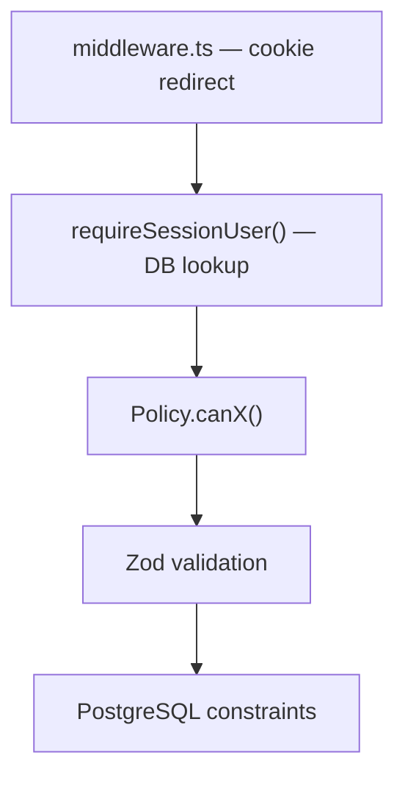
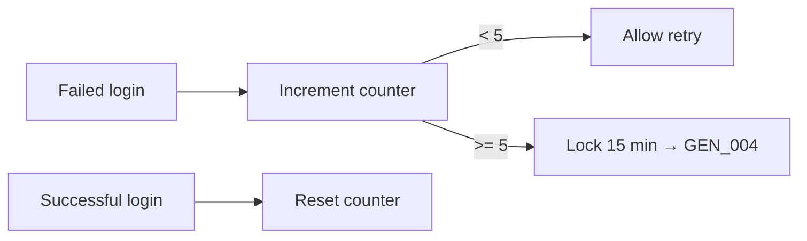

# Security

Supplements [auth-lifecycle.md](./auth-lifecycle.md) (identity, sessions, RBAC) with validation and abuse-prevention policies.

**Related:** [errors.md](../../docs/errors.md) · [business-invariants.md](../../docs/business-invariants.md)

---

## Defense in Depth

Identity and permissions: see [auth-lifecycle.md](./auth-lifecycle.md). This document covers credential policy, rate limiting, and file upload rules.

---

## Password Policy

Applied at signup, password reset, and change-password flows.

| Rule | Value |
|------|-------|
| Minimum length | 8 characters |
| Uppercase | At least 1 (`A–Z`) |
| Lowercase | At least 1 (`a–z`) |
| Number | At least 1 (`0–9`) |
| Special character | Not required (P1 stretch) |

Enforcement: Zod schema in `modules/identity/validators/password.schema.ts`. Better Auth stores bcrypt hash — never plaintext.

Seed default (`SEED_PASSWORD`) must satisfy this policy for demo accounts.

---

## Login Rate Limiting

Not required by Odoo; recommended hardening.

| Rule | Value |
|------|-------|
| Failed attempts before lock | 5 per email |
| Lock duration | 15 minutes |
| Scope | Per email address (not global IP) |
| Error code | `GEN_004` (429) |

Implementation options (pick one):

1. **Application:** `LoginAttempt` table or in-memory map keyed by normalized email
2. **Better Auth plugin:** rate-limit hook on sign-in endpoint

Lock applies to login only — not to authenticated API calls.

---

## File Upload Validation

Tier 2 feature (asset photos/documents). Validate before writing to storage.

| Rule | Value |
|------|-------|
| Allowed MIME types | `image/jpeg`, `image/png`, `image/webp`, `application/pdf` |
| Maximum file size | 5 MB |
| Filename | Sanitize — strip path segments, allow `[a-zA-Z0-9._-]` only |
| Storage | Never trust client-provided path; server generates object key |

| Violation | Code | HTTP |
|-----------|------|------|
| Unsupported type | `ASSET_008` | 400 |
| Exceeds size limit | `ASSET_009` | 400 |

Check MIME from file magic bytes where possible — do not trust `Content-Type` header alone.

---

## Client Input Rejection

Never accept from request body, query, or headers:

| Field | Source of truth |
|-------|-----------------|
| `userId` | Session |
| `role` | Database (`User.role`) |
| `departmentId` (for auth) | Database (`User.departmentId`) |
| `assetTag` on register | Server-generated sequence |

Signup and public endpoints ignore `role` in body. See [auth-lifecycle.md](./auth-lifecycle.md).

---

## Cron and Internal Routes

`GET /api/cron/overdue-check` requires `Authorization: Bearer $CRON_SECRET`. Reject missing or invalid secret before any business logic.

---

## What We Do Not Add

These do not improve the Odoo score and are out of scope:

- Redis, RabbitMQ, Kafka
- Microservices, CQRS, event sourcing
- Elasticsearch
- Generic workflow engines or base service abstractions
