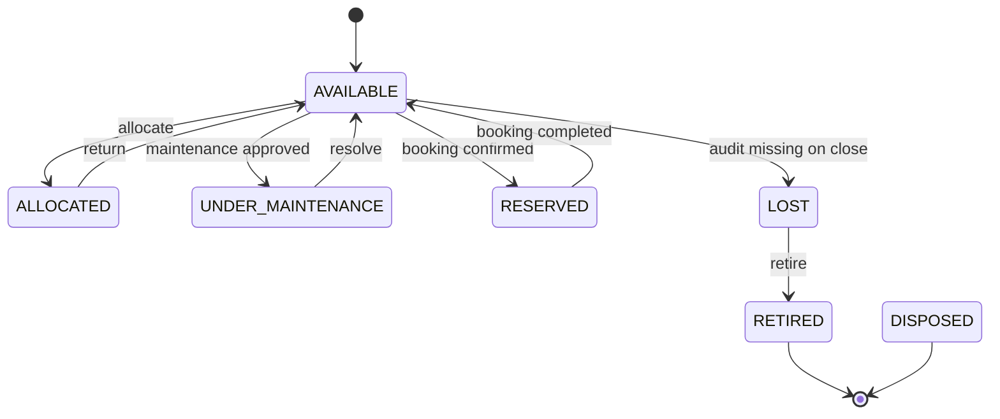

# State Transition Matrix — Asset

| Current | Next | Allowed |
|---------|------|---------|
| AVAILABLE | ALLOCATED | Yes |
| AVAILABLE | UNDER_MAINTENANCE | Yes |
| AVAILABLE | RESERVED | Yes |
| ALLOCATED | AVAILABLE | Yes |
| UNDER_MAINTENANCE | AVAILABLE | Yes |
| LOST | RETIRED | Yes |
| RETIRED | Any | No |
| DISPOSED | Any | No |

Terminal states (`RETIRED`, `DISPOSED`) are immutable.

**Code:** enforced by `AssetStateMachine` in `src/modules/asset/domain/asset-state-machine.ts`. Services call `AssetStateMachine.assertTransition(from, to)` before `updateStatus`.
