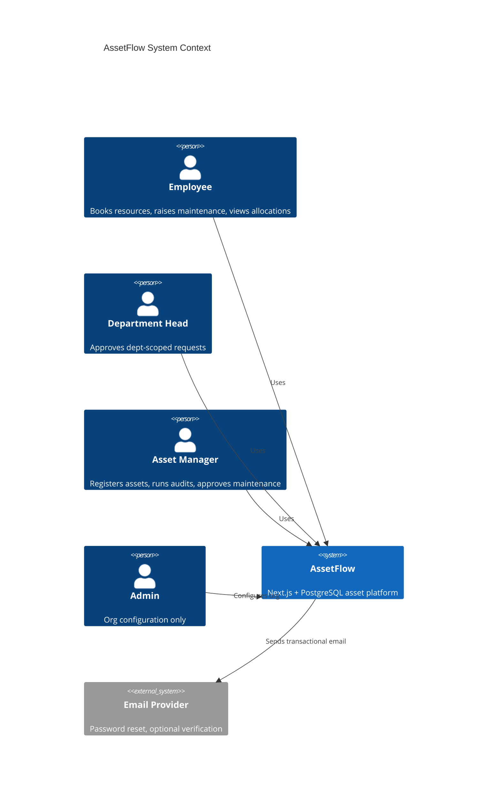
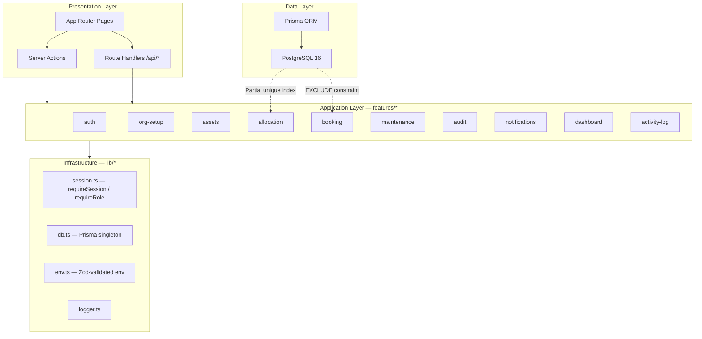
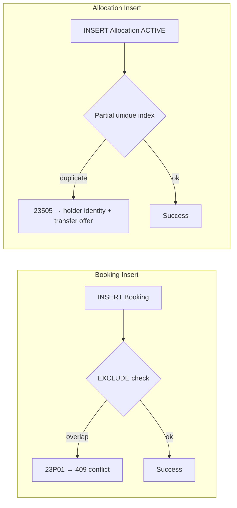
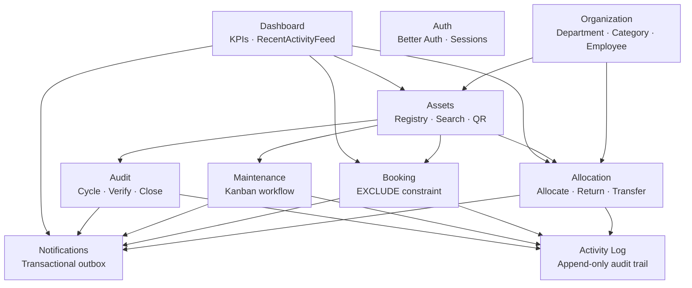
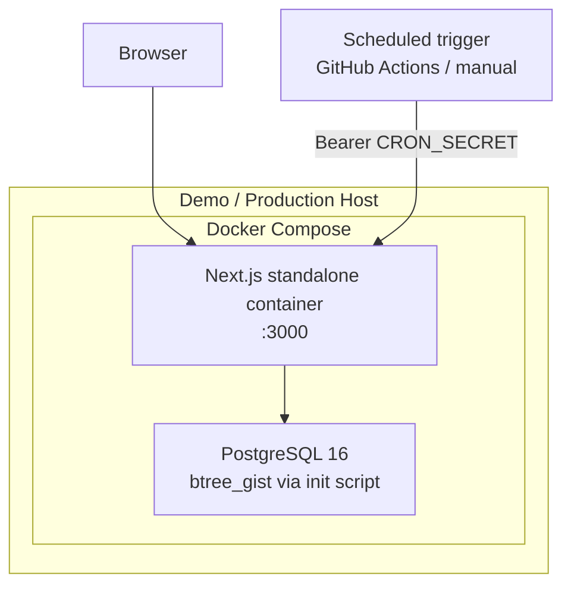
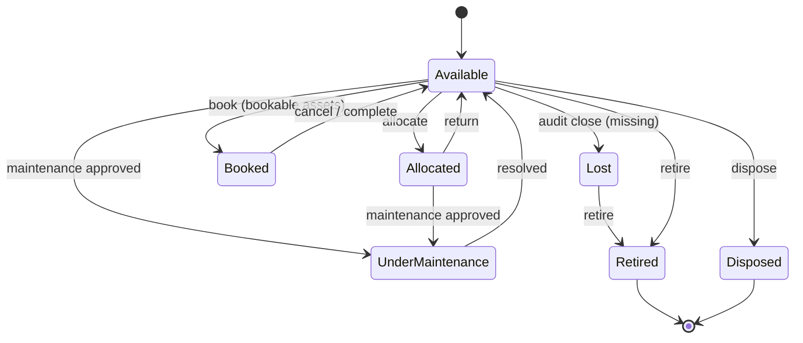

# AssetFlow — High-Level Design (HLD)

**Odoo Hackathon 2026 Virtual Round · Enterprise Asset & Resource Management**

This document describes *what* the system is and *how major components interact*. Implementation detail lives in [lld.md](./lld.md).

---

## 1. System Context

AssetFlow is an enterprise asset management platform where:

- Assets move through a **7-state lifecycle**
- Each asset can be **allocated to one holder** at a time
- Bookable assets accept **non-overlapping time-slot reservations**
- **Maintenance** and **audit cycles** gate and update asset status
- Every state change **notifies the right people** and is recorded in an append-only activity log



---

## 2. Roles & Capabilities

| Role | Primary Screens | Core Actions |
|------|-----------------|--------------|
| **Employee** | Dashboard, Allocation, Booking, Maintenance | View own allocations, book resources, raise maintenance, request return/transfer |
| **Department Head** | Dept dashboard, Approvals | Approve allocation/transfer within department, book on behalf of department |
| **Asset Manager** | Assets, Maintenance Kanban, Audit, Notifications | Register/allocate assets, approve maintenance/transfers, run audit cycles, search/QR |
| **Admin** | Organization Setup (3 tabs) | Departments, categories, employee directory, **only place roles are promoted** |

Signup always creates an **Employee** account. Role elevation happens exclusively via Admin → Employee Directory.

---

## 3. Architecture Overview



### Dependency Rule

```
app/ → features/ → lib/ → prisma/
```

- `app/` is routing only — no business logic
- `features/*` owns domain workflows (`actions.ts`, `queries.ts`, `schemas.ts`)
- `lib/` provides shared infrastructure (db, auth, session, env)
- Prisma is never imported outside `lib/db.ts` and `features/*/queries.ts` / transactions in `actions.ts`

---

## 4. Core Design Decisions

### 4.1 Database-Enforced Correctness

Two Tier 1 guarantees are enforced **in PostgreSQL**, not only in application code:

| Rule | Mechanism | Benefit |
|------|-----------|---------|
| No overlapping bookings | `EXCLUDE USING GIST` on `(assetId, tstzrange)` | Structurally impossible to double-book under concurrency |
| One active allocation per asset | Partial unique index `WHERE status = 'ACTIVE'` | Race-safe single-holder guarantee |



### 4.2 Transactional Notifications

Event-triggered notifications (`Asset Assigned`, `Booking Confirmed`, `Maintenance Approved`, etc.) are written **inside the same Prisma transaction** as the triggering mutation via `createNotification(tx, ...)`.

This guarantees: mutation and notification either both commit or both roll back — no orphaned notifications, no silent misses.

Time-based alerts (`Overdue Return`) use a **cron-guarded scan route** (`GET /api/cron/overdue-check`) with idempotent deduplication.

### 4.3 Auth — Defense in Depth

| Layer | Responsibility |
|-------|----------------|
| Middleware | Optimistic cookie-existence redirect (fast, not secure alone) |
| `requireSession()` / `requireRole()` | Full session verification on every Server Action and Route Handler |
| `requireDepartmentAccess()` | Department Head scoped to `session.departmentId` |

Identity is always derived from the server session — never from request body fields.

---

## 5. Module Map



**17–18 Prisma models** map 1:1 to screens — see [lld.md §3](./lld.md#3-data-model).

---

## 6. Tech Stack

| Layer | Choice |
|-------|--------|
| Framework | Next.js 15, App Router, TypeScript strict |
| ORM | Prisma |
| Database | PostgreSQL 16 (Docker) |
| Auth | Better Auth (session-based) |
| Validation | Zod (forms + `lib/env.ts`) |
| Frontend data | SWR polling for notifications |
| Testing | Vitest (unit + integration against CI Postgres) |
| Containerization | Docker Compose (postgres + app) |
| CI | GitHub Actions with Postgres service container |

---

## 7. Deployment Topology



**Primary path:** `docker compose up` from a clean clone — `btree_gist` installs automatically via `docker/init-extensions.sql`.

---

## 8. API Surface

| Prefix | Purpose |
|--------|---------|
| `/api/auth/[...all]` | Better Auth catch-all |
| `/api/health` | DB connectivity check (503 if down) |
| `/api/cron/overdue-check` | Time-based overdue return scan |
| Server Actions in `features/*/actions.ts` | All mutations |

Response envelope (all custom APIs):

```json
{ "success": true, "data": {}, "error": null, "meta": {} }
```

---

## 9. Transaction Boundaries (Atomic Operations)

| Workflow | Steps in one transaction |
|----------|--------------------------|
| **Allocate asset** | Create allocation → Update asset status → Activity log → Notification |
| **Approve maintenance** | Update request status → Asset → Under Maintenance → Activity → Notification |
| **Resolve maintenance** | Update request → Asset → Available → Activity → Notification |
| **Close audit cycle** | Lock cycle → Update missing assets → Lost → Generate report → Notifications |
| **Transfer approve** | Close old allocation → Create new → Activity → Notification |

---

## 10. Asset Status Lifecycle



Invalid transitions are rejected server-side. Terminal states (Retired, Disposed) have no outbound transitions.

---

## 11. Team Ownership (Build Phase)

| Person | Owns |
|--------|------|
| **P1** | Schema (locked after design), auth, org-setup, booking (EXCLUDE), employee vertical |
| **P2** | Department Head vertical, dept-scoped approvals, reports (Tier 2) |
| **P3** | Assets, allocation (manager), maintenance Kanban, audit, notifications, search/QR |

Feature folders in `src/features/` map directly to this split to minimize merge conflicts.

---

## 12. Related Documents

| Document | Contents |
|----------|----------|
| [lld.md](./lld.md) | Low-level design, schema, sequences, file contracts |
| [execution-plan.md](./execution-plan.md) | Day-of hackathon timeline and gates |
| [business-invariants.md](./business-invariants.md) | Non-negotiable domain rules |
| [errors.md](./errors.md) | API error catalogue |
| [architecture.md](./architecture.md) | Infrastructure patterns (Docker, CI, auth layers) |
