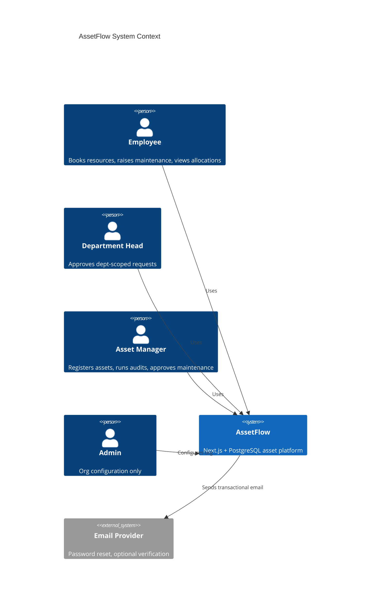
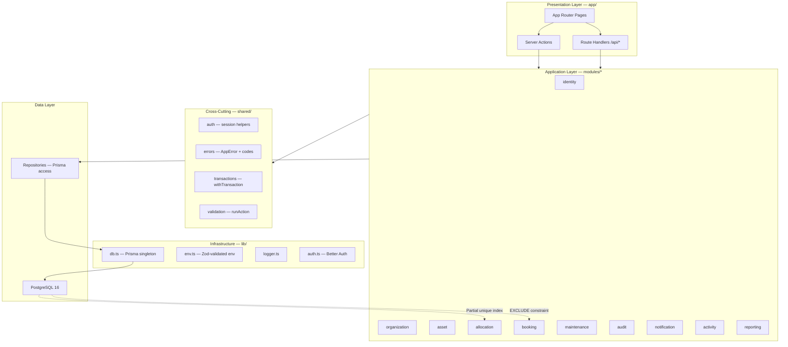
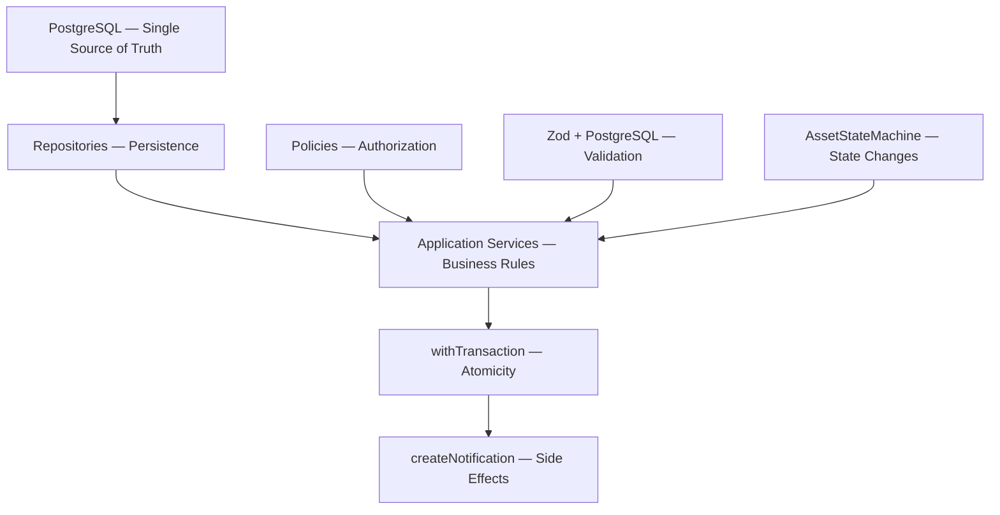
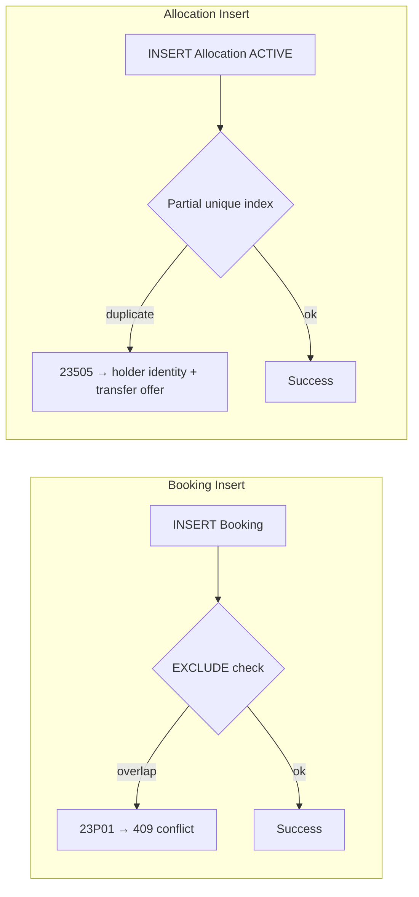
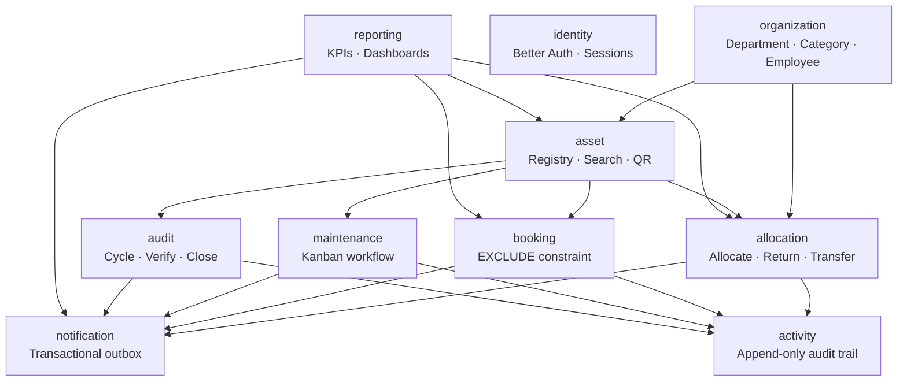
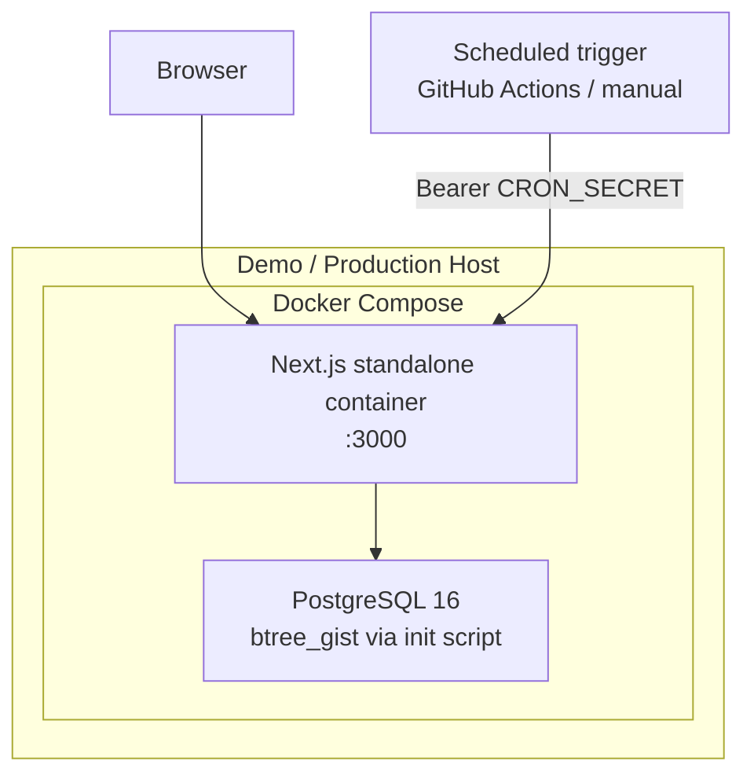
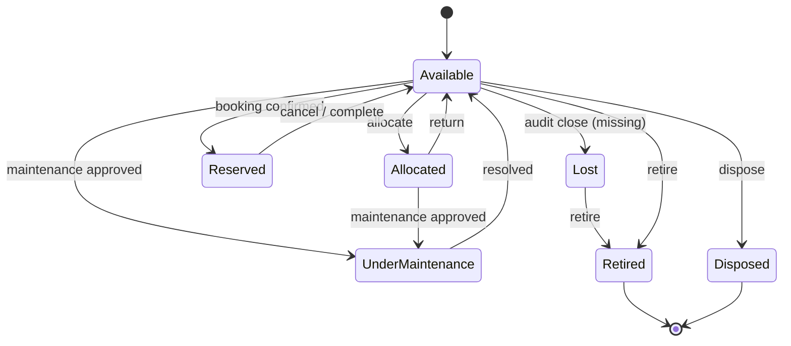

# AssetFlow — High-Level Design (HLD)

**Odoo Hackathon 2026 Virtual Round · Enterprise Asset & Resource Management**

This document describes *what* the system is and *how major components interact*. Implementation detail lives in [lld.md](./lld.md).

---

## 1. System Context

AssetFlow is an enterprise asset management platform where:

- Assets move through a **7-state lifecycle**
- Each asset can be **allocated to one holder** at a time
- Bookable assets accept **non-overlapping time-slot reservations**
- **Maintenance** and **audit cycles** gate and update asset status
- Every state change **notifies the right people** and is recorded in an append-only activity log



---

## 2. Roles & Capabilities

| Role | Primary Screens | Core Actions |
|------|-----------------|--------------|
| **Employee** | Dashboard, Allocation, Booking, Maintenance | View own allocations, book resources, raise maintenance, request return/transfer |
| **Department Head** | Dept dashboard, Approvals | Approve allocation/transfer within department, book on behalf of department |
| **Asset Manager** | Assets, Maintenance Kanban, Audit, Notifications | Register/allocate assets, approve maintenance/transfers, run audit cycles, search/QR |
| **Admin** | Organization Setup (3 tabs) | Departments, categories, employee directory, **only place roles are promoted** |

Signup always creates an **Employee** account. Role elevation happens exclusively via Admin → Employee Directory.

---

## 3. Architecture Overview



### Dependency Rule

```
app/ → modules/ → shared/ → lib/ → repositories → prisma/
```

- `app/` is routing only — no business logic
- `modules/*` owns domain workflows (actions, validators, policies, services, repositories)
- `shared/` provides cross-cutting concerns (auth, errors, transactions, validation)
- `lib/` provides framework infrastructure (db singleton, Better Auth, env, logger)
- **Repositories own all Prisma access** — services never call Prisma directly
- Modules depend on `shared/` only — never import from other modules

---

## 4. Dynamic Data Strategy

AssetFlow does **not** use static JSON as an application data source. All business data is retrieved from PostgreSQL through repositories and APIs.

```text
User → Server Action / Route Handler → Service → Repository → PostgreSQL → Response
```

**Dynamic data** (always live from the database):

- Departments, employees, asset categories
- Assets and current asset status
- Allocations, bookings, maintenance requests
- Audit cycles and verification results
- Notifications and activity log entries
- Dashboard KPIs and reports

**Static JSON is permitted only for:**

- `prisma/seed.ts` — initial database population
- Unit and integration test fixtures
- Early prototyping (must be removed before demo)

**Seed data exists only to populate the database. The application never reads from static files after startup.**

No production screen depends on hardcoded lists. Dropdowns query repositories (`DepartmentRepository.findAllActive()`, etc.). Admin creates categories and departments — exactly like Odoo master data.

### Dashboard and Reports

Dashboard KPIs are computed **per request** via live SQL aggregations — never cached in application memory or static JSON:

```sql
SELECT COUNT(*) FROM "Asset" WHERE status = 'AVAILABLE';
SELECT COUNT(*) FROM "Asset" WHERE status = 'ALLOCATED';
SELECT COUNT(*) FROM "MaintenanceRequest" WHERE status = 'PENDING';
```

Reports use live aggregation:

```sql
SELECT department_id, COUNT(*) FROM "Asset" GROUP BY department_id;
SELECT category_id, SUM(acquisition_cost) FROM "Asset" GROUP BY category_id;
```

Booking calendar, search (ILIKE + indexes), and notification feeds all query their respective tables on each request.

---

## 5. Architecture Principles



| Concern | Owner |
|---------|-------|
| Single source of truth | PostgreSQL |
| Business rules | Application services |
| Authorization | Policies (`assertCanAllocate`, `assertCanManage`, …) |
| Input validation | Zod validators + PostgreSQL constraints |
| State transitions | `AssetStateMachine` |
| Persistence | Repositories (all Prisma access) |
| Atomicity | `withTransaction()` in services only |
| Side effects | `createNotification(tx)` + `logActivity(tx)` inside transactions |

---

## 6. Core Design Decisions

### 6.1 Database-Enforced Correctness

Two Tier 1 guarantees are enforced **in PostgreSQL**, not only in application code:

| Rule | Mechanism | Benefit |
|------|-----------|---------|
| No overlapping bookings | `EXCLUDE USING GIST` on `(assetId, tstzrange)` | Structurally impossible to double-book under concurrency |
| One active allocation per asset | Partial unique index `WHERE status = 'ACTIVE'` | Race-safe single-holder guarantee |



### 6.2 Transactional Notifications

Event-triggered notifications (`Asset Assigned`, `Booking Confirmed`, `Maintenance Approved`, etc.) are written **inside the same Prisma transaction** as the triggering mutation via `createNotification(tx, ...)`.

This guarantees: mutation and notification either both commit or both roll back — no orphaned notifications, no silent misses.

Time-based alerts (`Overdue Return`) use a **cron-guarded scan route** (`GET /api/cron/overdue-check`) with idempotent deduplication.

### 6.3 Auth — Defense in Depth

Engineering reference: [auth-lifecycle.md](../backend/engineering/auth-lifecycle.md)

| Layer | Responsibility |
|-------|----------------|
| Middleware | Optimistic cookie-existence redirect (fast, not secure alone) |
| `requireSession()` | Better Auth token validation |
| `requireSessionUser()` | Fresh `User` lookup from PostgreSQL (role + status) |
| `requireDepartmentAccess()` | Department Head scoped to `session.departmentId` |
| Policies | Authorization per action |

Identity is always derived from the server session plus a **live database lookup** — never from request body fields or stale cookie payload.

---

## 7. Module Map



**17–18 Prisma models** map 1:1 to screens — see [lld.md §3](./lld.md#3-data-model).

---

## 8. Tech Stack

| Layer | Choice |
|-------|--------|
| Framework | Next.js 15, App Router, TypeScript strict |
| ORM | Prisma |
| Database | PostgreSQL 16 (Docker) |
| Auth | Better Auth (session-based) |
| Validation | Zod (forms + `lib/env.ts`) |
| Frontend data | SWR polling for notifications |
| Testing | Vitest (unit + integration against CI Postgres) |
| Containerization | Docker Compose (postgres + app) |
| CI | GitHub Actions with Postgres service container |

---

## 9. Deployment Topology



**Primary path:** `docker compose up` from a clean clone — `btree_gist` installs automatically via `docker/init-extensions.sql`.

---

## 10. API Surface

| Prefix | Purpose |
|--------|---------|
| `/api/auth/[...all]` | Better Auth catch-all |
| `/api/health` | DB connectivity check (503 if down) |
| `/api/cron/overdue-check` | Time-based overdue return scan |
| Server Actions in `modules/*/actions/` | All mutations |

Response envelope (all custom APIs):

```json
{ "success": true, "data": {}, "error": null, "meta": {} }
```

---

## 11. Transaction Boundaries (Atomic Operations)

| Workflow | Steps in one transaction |
|----------|--------------------------|
| **Allocate asset** | Create allocation → Update asset status → Activity log → Notification |
| **Approve maintenance** | Update request status → Asset → Under Maintenance → Activity → Notification |
| **Resolve maintenance** | Update request → Asset → Available → Activity → Notification |
| **Close audit cycle** | Lock cycle → Update missing assets → Lost → Generate report → Notifications |
| **Transfer approve** | Close old allocation → Create new → Activity → Notification |

---

## 12. Asset Status Lifecycle



Invalid transitions are rejected server-side via `AssetStateMachine`. Terminal states (Retired, Disposed) have no outbound transitions.

---

## 13. Team Ownership (Build Phase)

| Person | Owns |
|--------|------|
| **P1** | Schema (locked after design), auth, identity, organization, booking (EXCLUDE), employee vertical |
| **P2** | Department Head vertical, dept-scoped approvals, reports (Tier 2) |
| **P3** | Assets, allocation (manager), maintenance Kanban, audit, notifications, search/QR |

Module folders in `src/modules/` map directly to this split to minimize merge conflicts.

---

## 14. Related Documents

| Document | Contents |
|----------|----------|
| [lld.md](./lld.md) | Low-level design, schema, sequences, file contracts |
| [execution-plan.md](./execution-plan.md) | Day-of hackathon timeline and gates |
| [business-invariants.md](./business-invariants.md) | Non-negotiable domain rules |
| [errors.md](./errors.md) | Canonical API error catalogue |
| [architecture.md](./architecture.md) | Infrastructure patterns (Docker, CI, auth layers) |
| [../backend/database/constraints.md](../backend/database/constraints.md) | PostgreSQL constraint inventory |
| [../backend/engineering/state-transition-matrix.md](../backend/engineering/state-transition-matrix.md) | Asset status transitions |
| [../backend/engineering/edge-cases.md](../backend/engineering/edge-cases.md) | Prioritized edge-case inventory |
