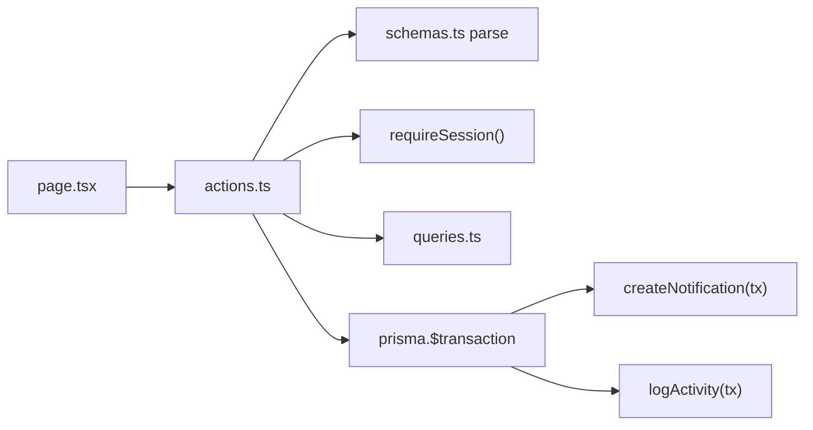
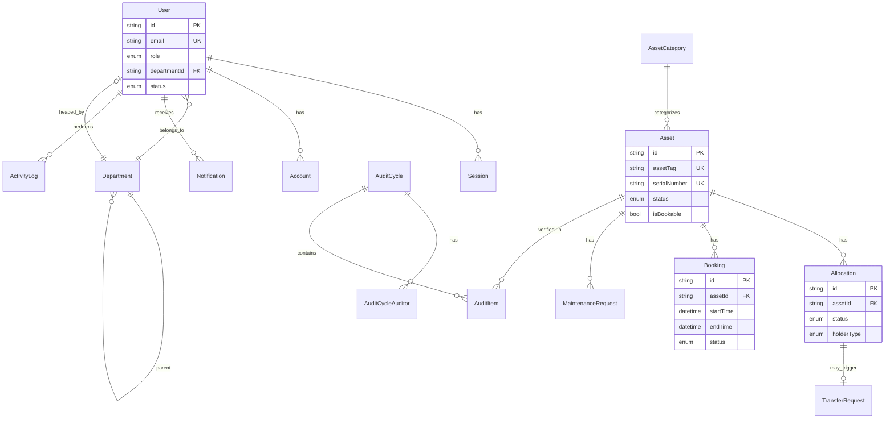
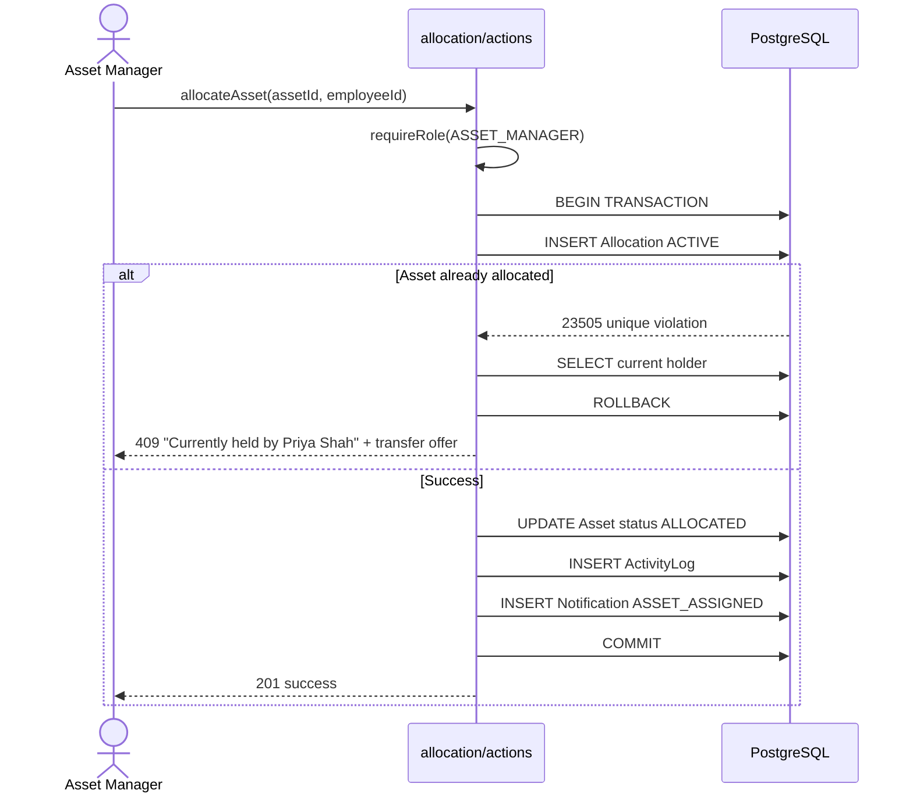
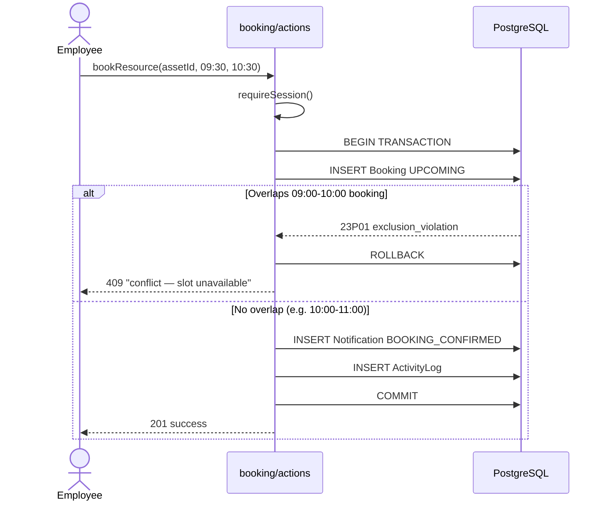
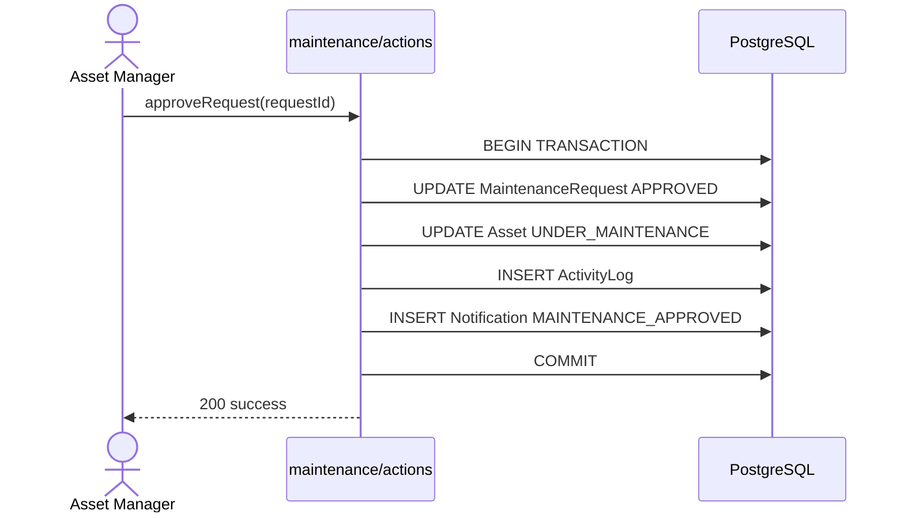
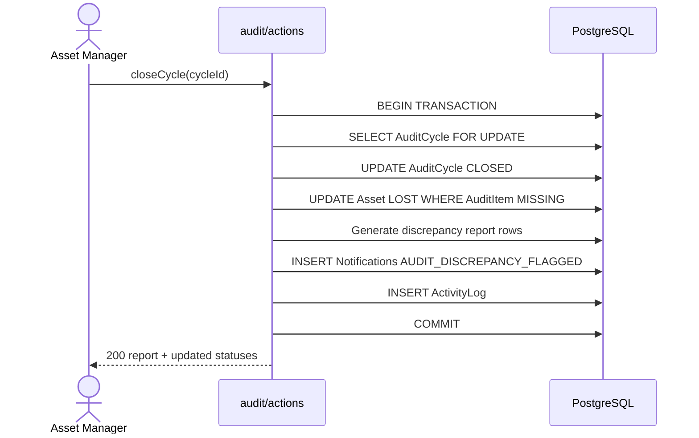
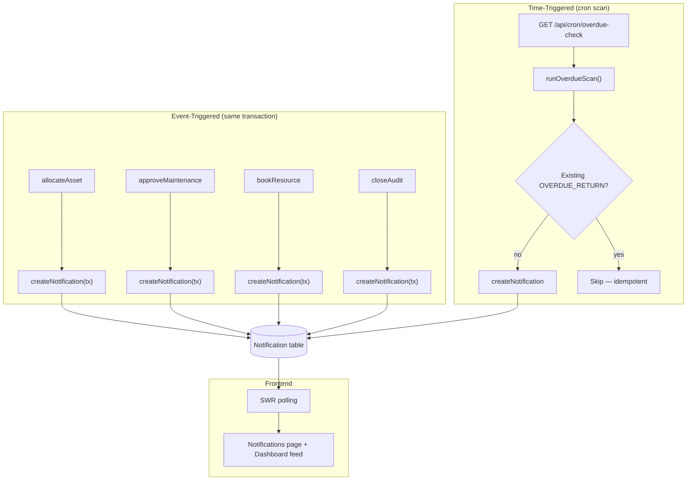
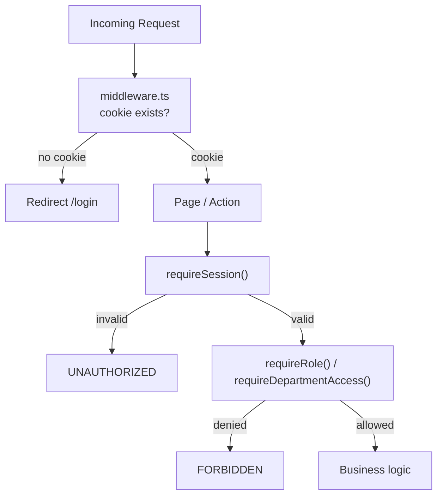

# AssetFlow — Low-Level Design (LLD)

**Companion to [hld.md](./hld.md) — implementation contracts, schema, and sequences**

---

## 1. Repository Layout

```
assetflow/
├── .github/workflows/
│   ├── ci.yml
│   └── migrate-check.yml
├── docker/
│   ├── Dockerfile
│   ├── docker-compose.override.yml
│   └── init-extensions.sql
├── docker-compose.yml
├── prisma/
│   ├── schema.prisma          # P1-owned after schema lock
│   ├── migrations/
│   └── seed.ts
├── src/
│   ├── app/                   # Routing only
│   │   ├── (auth)/login, signup
│   │   ├── (dashboard)/       # Screens 2–10
│   │   └── api/
│   │       ├── auth/[...all]/route.ts
│   │       ├── health/route.ts
│   │       └── cron/overdue-check/route.ts
│   ├── features/              # Business logic — one folder per domain
│   │   ├── auth/
│   │   ├── org-setup/
│   │   ├── assets/
│   │   ├── allocation/
│   │   ├── booking/
│   │   ├── maintenance/
│   │   ├── audit/
│   │   ├── notifications/
│   │   ├── dashboard/
│   │   └── activity-log/
│   ├── components/            # Shared UI (DepartmentPicker, RecentActivityFeed, …)
│   └── lib/
│       ├── db.ts
│       ├── env.ts
│       ├── auth.ts
│       ├── auth-client.ts
│       ├── session.ts
│       └── logger.ts
├── tests/
│   ├── unit/
│   └── integration/
└── CONVENTIONS.md
```

### Feature Module Contract

Every `features/<domain>/` folder exposes:

| File | Responsibility |
|------|----------------|
| `schemas.ts` | Zod input/output types |
| `queries.ts` | Read-only Prisma queries |
| `actions.ts` | Server Actions — mutations, transactions, auth checks |



---

## 2. Prisma Schema Overview

### 2.1 Model Inventory (17 core + 1 optional)



### 2.2 Enums

```prisma
enum UserRole { EMPLOYEE DEPARTMENT_HEAD ASSET_MANAGER ADMIN }
enum UserStatus { ACTIVE INACTIVE }
enum DepartmentStatus { ACTIVE INACTIVE }
enum AssetStatus { AVAILABLE ALLOCATED RESERVED UNDER_MAINTENANCE LOST RETIRED DISPOSED }
enum AllocationStatus { ACTIVE RETURNED }
enum HolderType { EMPLOYEE DEPARTMENT }
enum BookingStatus { UPCOMING ONGOING COMPLETED CANCELLED }
enum MaintenanceStatus { PENDING APPROVED REJECTED TECHNICIAN_ASSIGNED IN_PROGRESS RESOLVED }
enum MaintenancePriority { LOW MEDIUM HIGH CRITICAL }
enum AuditCycleStatus { OPEN CLOSED }
enum VerificationStatus { PENDING VERIFIED MISSING DAMAGED }
enum TransferStatus { REQUESTED APPROVED REJECTED COMPLETED }
enum NotificationType {
  ASSET_ASSIGNED MAINTENANCE_APPROVED MAINTENANCE_REJECTED
  BOOKING_CONFIRMED BOOKING_CANCELLED BOOKING_REMINDER
  TRANSFER_APPROVED OVERDUE_RETURN_ALERT AUDIT_DISCREPANCY_FLAGGED
}
```

### 2.3 Database Constraints (Raw SQL Migrations)

**Booking overlap** — hand-edited migration (P1-only):

```sql
CREATE EXTENSION IF NOT EXISTS btree_gist;

ALTER TABLE "Booking" ADD CONSTRAINT no_overlapping_bookings
  EXCLUDE USING GIST (
    "assetId" WITH =,
    tstzrange("startTime", "endTime", '[)') WITH &&
  ) WHERE (status IN ('UPCOMING', 'ONGOING'));
```

**Allocation conflict** — partial unique index:

```sql
CREATE UNIQUE INDEX one_active_allocation_per_asset
  ON "Allocation" ("assetId") WHERE status = 'ACTIVE';
```

**Additional CHECK constraints:**

```sql
ALTER TABLE "Booking" ADD CONSTRAINT booking_end_after_start CHECK ("endTime" > "startTime");
ALTER TABLE "Allocation" ADD CONSTRAINT return_after_allocate CHECK (
  "actualReturnDate" IS NULL OR "actualReturnDate" >= "allocatedAt"
);
ALTER TABLE "Asset" ADD CONSTRAINT cost_non_negative CHECK ("acquisitionCost" >= 0);
```

### 2.4 Indexes

| Table | Index | Purpose |
|-------|-------|---------|
| `Asset` | `assetTag`, `serialNumber` | Search (Screen 4) |
| `Asset` | `status`, `categoryId`, `location` | Filter |
| All FKs | `@@index` on foreign keys | Join performance |
| `Notification` | `(recipientId, isRead, createdAt)` | Unread feed |
| `ActivityLog` | `(createdAt DESC)` | Recent activity |

---

## 3. Data Model

See [business-invariants.md](./business-invariants.md) for rules each model must uphold.

### Asset Tag Generation

```
Format: AF-000001 (sequential, not UUID)
Strategy: SELECT MAX + 1 inside transaction with advisory lock
         OR dedicated AssetTagSequence table with row lock
```

---

## 4. API & Server Action Contracts

### 4.1 Auth (`features/auth/`)

| Action | Auth | Rule |
|--------|------|------|
| `signUp` | Public | Always creates `EMPLOYEE`; ignores any `role` in body |
| `signIn` | Public | Session cookie on success |
| `forgotPassword` | Public | 15-min token, hashed, one-time |
| `promoteEmployee` | `ADMIN` only | Only path to change roles |

### 4.2 Organization (`features/org-setup/`)

| Action | Auth | Rule |
|--------|------|------|
| `createDepartment` | `ADMIN` | Validates no hierarchy cycle |
| `updateDepartment` | `ADMIN` | Live data for `DepartmentPicker` |
| `deactivateDepartment` | `ADMIN` | Blocked if active employees exist |
| `createCategory` | `ADMIN` | Optional JSON custom fields |
| `promoteEmployee` | `ADMIN` | Employee → Dept Head / Asset Manager |

### 4.3 Assets (`features/assets/`)

| Action | Auth | Rule |
|--------|------|------|
| `registerAsset` | `ASSET_MANAGER` | Auto-generates tag, enforces unique serial |
| `searchAssets` | Authenticated | ILIKE on tag, serial, name, location; ranked |
| `updateAssetStatus` | `ASSET_MANAGER` | State machine validation |

### 4.4 Allocation (`features/allocation/`)

| Action | Auth | Rule |
|--------|------|------|
| `allocateAsset` | `ASSET_MANAGER` | Partial unique index; on conflict return holder name + transfer offer |
| `returnAsset` | `ASSET_MANAGER` / holder | Condition notes, status → Available |
| `requestTransfer` | `EMPLOYEE` | Creates TransferRequest |
| `approveTransfer` | `DEPT_HEAD` / `ASSET_MANAGER` | Closes old allocation, opens new |

### 4.5 Booking (`features/booking/`)

| Action | Auth | Rule |
|--------|------|------|
| `bookResource` | Authenticated | Catches `23P01` → "conflict — slot unavailable" |
| `cancelBooking` | Owner / manager | Status → CANCELLED |
| `rescheduleBooking` | Owner / manager | Cancel + rebook in transaction |

### 4.6 Maintenance (`features/maintenance/`)

| Action | Auth | Rule |
|--------|------|------|
| `raiseRequest` | Authenticated | Creates PENDING |
| `approveRequest` | `ASSET_MANAGER` | Asset → UNDER_MAINTENANCE |
| `assignTechnician` | `ASSET_MANAGER` | Status → TECHNICIAN_ASSIGNED |
| `resolveRequest` | `ASSET_MANAGER` | Asset → AVAILABLE |

### 4.7 Audit (`features/audit/`)

| Action | Auth | Rule |
|--------|------|------|
| `createCycle` | `ASSET_MANAGER` | Scope + date range + auditors |
| `verifyAsset` | Assigned auditor | VERIFIED / MISSING / DAMAGED |
| `closeCycle` | `ASSET_MANAGER` | Lock cycle, Missing → Lost, discrepancy report |

---

## 5. Sequence Diagrams

### 5.1 Allocate Asset (with conflict)



### 5.2 Book Resource (overlap rejection)



### 5.3 Maintenance Approval Cascade



### 5.4 Close Audit Cycle



---

## 6. Notification Architecture



### `createNotification` signature

```typescript
export async function createNotification(
  tx: Prisma.TransactionClient,
  input: {
    recipientId: string;
    type: NotificationType;
    message: string;
    relatedEntityType: string;
    relatedEntityId: string;
  }
): Promise<Notification>;
```

---

## 7. Auth Layer Detail



### Department scoping (P2)

```typescript
export async function requireDepartmentAccess(departmentId: string) {
  const session = await requireRole("DEPARTMENT_HEAD", "ASSET_MANAGER", "ADMIN");
  if (
    session.user.role === "DEPARTMENT_HEAD" &&
    session.user.departmentId !== departmentId
  ) {
    throw new Error("FORBIDDEN");
  }
  return session;
}
```

---

## 8. Shared Components

| Component | Used By | Data Source |
|-----------|---------|-------------|
| `DepartmentPicker` | Org Setup, Asset Registration, Allocation | Live `features/org-setup/queries` |
| `RecentActivityFeed` | Dashboard (Screen 2), Notifications (Screen 10) | `ActivityLog` + `Notification` query |
| `MaintenanceKanban` | Maintenance (Screen 7) | 5 columns, click-to-advance |
| `AssetQRCode` | Asset detail | `react-qr-code` encoding `assetTag` |

---

## 9. Seed Data (Demo Cast)

Aligned with mockup scenarios for coherent demo walkthrough:

| Entity | Seed Value |
|--------|------------|
| Departments | Engineering (Aditi Rao), Field Ops East (Sana Iqbal, Inactive), Facilities (Rohan Mehta) |
| Assets | `AF-0114` Dell Laptop → Priya Shah; `AF-0062` Projector mid-maintenance; Conference Room B2 (bookable) |
| Booking | Room B2 09:00–10:00 Procurement Team (enables 09:30 conflict demo) |
| Audit | Engineering cycle, auditors Aditi Rao + Sana Iqbal, mixed verification results |

---

## 10. Testing Contracts

| Owner | Integration Test |
|-------|------------------|
| P1 | Booking overlap 09:00 vs 09:30 rejects, 10:00–11:00 accepts; signup ignores client `role` |
| P2 | Dept Head cannot approve other department; overdue allocation flagged |
| P3 | Allocation conflict returns holder name; audit close → Lost; maintenance cascade |

---

## 11. Performance Budget

| Metric | Target |
|--------|--------|
| Response time | < 150 ms (p95) |
| Queries per request | < 3 |
| Pagination default | 20, max 100 |
| Prisma | `select` projections only; no blind `include` |

---

## 12. Environment Variables

Validated at boot via `lib/env.ts` (Zod). See `.env.example`.

| Variable | Purpose |
|----------|---------|
| `DATABASE_URL` | Pooled connection (`connection_limit=10`) |
| `DIRECT_URL` | Unpooled — migrations |
| `BETTER_AUTH_SECRET` | Session signing (min 32 chars) |
| `BETTER_AUTH_URL` | App base URL |
| `CRON_SECRET` | Guards `/api/cron/overdue-check` |
